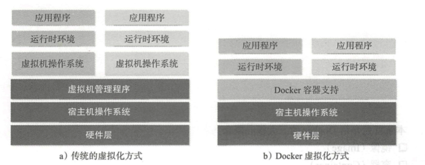
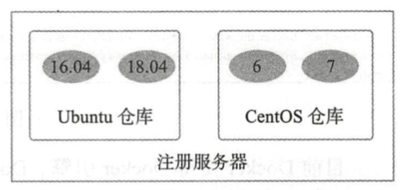

# 参考

- Docker技术入门与实战 第三版 杨保华戴王剑曹亚仑 编著
- [Docker — 从入门到实践](https://yeasy.gitbooks.io/docker_practice/content/)

# docker 介绍

## 什么是docker

Docker是基于 Go 语言实现的开源容器项目 。 它诞生于 2013 年年初，最初发起者是dotCloud公司 。 Docker 自开源后受到业界广泛的关注和参与，目前已有 80 多个相关开源组件项目(包括 Containerd、Moby、Swarm 等)，逐渐形成了围绕 Docker容器的完整的生态体系 。
dotCloud 公司也随之快速 发展壮大，在 2013 年年底直接改名为 Docker Inc，并专注于Docker 相关技术和 产品的开发，目前已经成为全球最大的 Docker 容器服务提供商 。 官方网站为 docker.com。
Docker 的构想是要实现“ Build, Ship and Run Any App, Anywhere”，即通过对应用的封装( Packaging)、分发( Distribution)、部署( Deployment)、运行( Runtime)生命周期进行管理，达到应用组件级别的“ 一次封装 ，到处运行” 。 这里的应用组件， 既可以 是一个 Web 应用、一个编译环境，也可以是一套数据库平台服务，甚至是一个操作系统或集群。

简单地讲，读者可以将 Docker 容器理解为一种轻量级的沙盒( sandbox)。 每个容器内运行着一个应用，不同的容器相互隔离，容器之间也可以通过网络互相通信。 容器的创建和停止十分快速，几乎跟创建和终止原生应用一致;另外，容器自身对系统资源的额外需求也十分有限，远远低于传统虚拟机 。 很多时候，甚至直接把容器当作应用本身也没有任何问题。

## 为什么要使用 Docker

### Docker容器虚拟化的好处

在云时代，开发者创建的应用必须要能很方便地在网络上传播，也就是说应用必须脱离底层物理硬件的限制;同时必须是“任何时间任何地点”可获取的 。 因此，开发者们需要一种新型的创建分布式应用程序的方式，快速分发和部署，而这正是 Docker所能够提供的最大优势 
Docker 提供了一种聪明的方式，通过容器来打包应用、解藕应用和运行平台 。这意味着迁移的时候，只需要在新的服务器上启动需要的容器就可以了，无论新旧服务器是否是同一类型的平台 。 这无疑将帮助我们节约大量的宝贵时间，并降低部署过程出现问题的风险 。

### Docker在开发和运维中的优势

- 更快速的交付和部署

  使用 Docker，开发人员可以使用镜像来快速构建一套标准的开发环境;开发完成之后，测试和运维人员可以直接使用完全相同的环境来部署代码 。 

- 更高效的资源利用

  运行 Docker 容器不需要额外的虚拟化管理程序( Virtual MachineManager, VMM ，以及 Hypervisor)的支持， Docker 是内核级的虚拟化，可以实现更高的性能，同时对资源的额外需求很低 。 与传统虚拟机方式相比， Docker 的性能要

  提高 1~2个数量级。

- 轻松的迁移和扩展

- 更简单的更新管理

  使用 Dockerfile，只需要小小的配置修改，就可以替代以往大量的更新工作。 所有修改都以增量的方式被分发和更新，从而实现自动化并且高效的容 器管理 。

### Docker与虚拟机比较

Docker容器技术与传统虚拟机技术的比较


| 特 性    | 容器               | 虚拟机     |
| -------- | ------------------ | ---------- |
| 启动速度 | 秒级               | 分钟级     |
| 性能     | 接近原生           | 较弱       |
| 内存代价 | 很小               | 较多       |
| 硬盘使用 | 一般为 MB          | 一般为 GB  |
| 运行密度 | 单机支持上千个容器 | 一般几十个 |
| 隔离性   | 安全隔离           | 完全隔离   |
| 迁移性   | 优秀               | 一般       |




传统方式是在硬件层面实现虚拟化，需要有额外的虚拟机管理应用和虚拟机操作系统层。 Docker容器是在操作系统层面上实现虚拟化，直接复用本地主机的操作系统，因此更加轻量级 。

# 核心概念与安装配置

## 核心概念

## 镜像

Docker镜像类似于虚拟机镜像，可以将它理解为一个只读的模板 。

Docker 镜像是一个特殊的文件系统，除了提供容器运行时所需的程序、库、资源、配置等文件外，还包含了一些为运行时准备的一些配置参数（如匿名卷、环境变量、用户等）。镜像不包含任何动态数据，其内容在构建之后也不会被改变。

### 分层存储

因为镜像包含操作系统完整的 `root` 文件系统，其体积往往是庞大的，因此在 Docker 设计时，就充分利用 [Union FS](https://en.wikipedia.org/wiki/Union_mount) 的技术，将其设计为分层存储的架构。所以严格来说，镜像并非是像一个 ISO 那样的打包文件，镜像只是一个虚拟的概念，其实际体现并非由一个文件组成，而是由一组文件系统组成，或者说，由多层文件系统联合组成。

镜像构建时，会一层层构建，前一层是后一层的基础。每一层构建完就不会再发生改变，后一层上的任何改变只发生在自己这一层。比如，删除前一层文件的操作，实际不是真的删除前一层的文件，而是仅在当前层标记为该文件已删除。在最终容器运行的时候，虽然不会看到这个文件，但是实际上该文件会一直跟随镜像。因此，在构建镜像的时候，需要额外小心，每一层尽量只包含该层需要添加的东西，任何额外的东西应该在该层构建结束前清理掉。

分层存储的特征还使得镜像的复用、定制变的更为容易。甚至可以用之前构建好的镜像作为基础层，然后进一步添加新的层，以定制自己所需的内容，构建新的镜像。

## 容器

镜像（`Image`）和容器（`Container`）的关系，就像是面向对象程序设计中的 `类` 和 `实例` 一样，镜像是静态的定义，容器是镜像运行时的实体。容器可以被创建、启动、停止、删除、暂停等。

容器的实质是进程，但与直接在宿主执行的进程不同，容器进程运行于属于自己的独立的 [命名空间](https://en.wikipedia.org/wiki/Linux_namespaces)。因此容器可以拥有自己的 `root` 文件系统、自己的网络配置、自己的进程空间，甚至自己的用户 ID 空间。容器内的进程是运行在一个隔离的环境里，使用起来，就好像是在一个独立于宿主的系统下操作一样。这种特性使得容器封装的应用比直接在宿主运行更加安全。也因为这种隔离的特性，很多人初学 Docker 时常常会混淆容器和虚拟机。

前面讲过镜像使用的是分层存储，容器也是如此。每一个容器运行时，是以镜像为基础层，在其上创建一个当前容器的存储层，我们可以称这个为容器运行时读写而准备的存储层为 **容器存储层**。

容器存储层的生存周期和容器一样，容器消亡时，容器存储层也随之消亡。因此，任何保存于容器存储层的信息都会随容器删除而丢失。

按照 Docker 最佳实践的要求，容器不应该向其存储层内写入任何数据，容器存储层要保持无状态化。所有的文件写入操作，都应该使用 [数据卷（Volume）](https://yeasy.gitbooks.io/docker_practice/content/data_management/volume.html)、或者绑定宿主目录，在这些位置的读写会跳过容器存储层，直接对宿主（或网络存储）发生读写，其性能和稳定性更高。

数据卷的生存周期独立于容器，容器消亡，数据卷不会消亡。因此，使用数据卷后，容器删除或者重新运行之后，数据却不会丢失。

## 仓库

Docker仓库类似于代码仓库，是 Docker集中存放镜像文件的场所。

有时候我们会将 Docker仓库和仓库注册服务器( Register)混为一谈，并不严格区分。 实际上，仓库注册服务器是存放仓库的地方，其上往往存放着多个仓库。 每个仓库集中存放某一类镜像，往往包括多个镜像文件，通过不同的标签( tag)来进行区分。 



## 安装

[MacOS Docker 安装](https://www.runoob.com/docker/macos-docker-install.html)

# 使用docker镜像

## 获取镜像

从 Docker 镜像仓库获取镜像的命令是 `docker pull`。其命令格式为：`docker pull [选项] [Docker Registry 地址[:端口号]/]仓库名[:标签]`

具体的选项可以通过 `docker pull --help` 命令看到，这里我们说一下镜像名称的格式。

- Docker 镜像仓库地址：地址的格式一般是 `<域名/IP>[:端口号]`。默认地址是 Docker Hub。
- 仓库名：仓库名是两段式名称，即 `<用户名>/<软件名>`。对于 Docker Hub，如果不给出用户名，则默认为 `library`，也就是官方镜像。

例如：获取nginx镜像

```
~ » docker pull nginx  
Using default tag: latest
latest: Pulling from library/nginx
b8f262c62ec6: Pull complete
a6639d774c21: Pull complete
22a7aa8442bf: Pull complete
Digest: sha256:9688d0dae8812dd2437947b756393eb0779487e361aa2ffbc3a529dca61f102c
Status: Downloaded newer image for nginx:latest
docker.io/library/nginx:latest
```

## 查看镜像信息

### 使用images命令列出镜像

使用docker images或docker image ls 命令可以列出本地主机上已有镜像的基 本信息。更多子命令选项还可以通过man docker-images来查看。

```
~ » docker images 
REPOSITORY          TAG                 IMAGE ID            CREATED             SIZE
nginx               latest              ab56bba91343        9 days ago          126MB
ubuntu              15.10               9b9cb95443b5        3 years ago         137MB
```

在列出信息中， 可以看到几个字段信息:

- 来自于哪个仓库，比如ubuntu表示ubuntu系列的基础镜像;
-  镜像的标签信息， 比如 15.10 、 latest 表示不同的版本信息。 标签只是标记， 并不能标识镜像内容;
- 镜像的ID(唯一标识镜像)， 如果两个镜像的ID相同， 说明它们实际上指向了同一个镜像， 只是具有不同标签名称而已;
- 创建时间， 说明镜像最后的更新时间;
- 镜像大小， 优秀的镜像往往体积都较小。

其中镜像的ID信息十分重要， 它唯一标识了镜像。在使用镜像ID的时候， 一般可以使用该ID的前若干个字符组成的可区分串来替代完整的ID。
TAG 信息用于标记来自同一个仓库的不同镜像。 例如 ubuntu 仓库中有多个镜像， 通过TAG 信息来区分发行版本， 如 15.04 、 15.10 等。
镜像大小信息只是表示了该镜像的逻辑体积大小， 实际上由于相同的镜像层本地只会存储一份， 物理上占用的存储空间会小于各镜像逻辑体积之和。

### 使用inspect命令查看详细信息

使用docker [image] inspect命令可以获取该镜像的详细信息，包括制作者、适应架构、各层的数字摘要等:

```
~ » docker inspect nginx:latest                                                                                                                                                           zch@zhangchenghao
[
    {
        "Id": "sha256:ab56bba91343aafcdd94b7a44b42e12f32719b9a2b8579e93017c1280f48e8f3",
        "RepoTags": [
            "nginx:latest"
        ],
        "RepoDigests": [
            "nginx@sha256:9688d0dae8812dd2437947b756393eb0779487e361aa2ffbc3a529dca61f102c"
        ],
        "Parent": "",
        "Comment": "",
        "Created": "2019-09-12T14:37:49.527989907Z",
        "Container": "49cfbf9256bcfa70580397e77b5be67d6488061ae7fbb348fa79c8aec922637e",
        ...............
```

## 搜寻镜像

使用 docker search 命令可以搜索Docker Hub 官方仓库中的镜像。 语法为 docker search [option] keyword。 支持的命令选项主要包括:

-  -f, --filter filter: 过滤输出内容;
- -format string: 格式化输出内容;
- --limit int:限制输出结果个数， 默认为 25 个;
- --no-trunc: 不截断输出结果。 

例如， 搜索官方提供的带 nginx关键字的镜像， 如下所示:

```
~ » docker search --filter=is-official=true nginx 
NAME                DESCRIPTION                STARS               OFFICIAL            AUTOMATED
nginx               Official build of Nginx.   11974               [OK]
```

再比如， 搜索所有收藏数超过 4 的关键词包括 tensorflow 的镜像:

```
~ » docker search --filter=stars=4 tensorflow 
NAME                             DESCRIPTION                                     STARS               OFFICIAL            AUTOMATED
tensorflow/tensorflow            Official Docker images for the machine learn…   1509
jupyter/tensorflow-notebook      Jupyter Notebook Scientific Python Stack w/ …   169
tensorflow/serving               Official images for TensorFlow Serving (http…   64
xblaster/tensorflow-jupyter      Dockerized Jupyter with tensorflow              52                                      [OK]
rocm/tensorflow                  Tensorflow with ROCm backend support            27
floydhub/tensorflow              tensorflow                                      22                                      [OK]
bitnami/tensorflow-serving       Bitnami Docker Image for TensorFlow Serving     13                                      [OK]
opensciencegrid/tensorflow-gpu   TensorFlow GPU set up for OSG                   9
ibmcom/tensorflow-ppc64le        Community supported ppc64le docker images fo…   5
```

## 删除和清理镜像

### 使用标签删除镜像

使用 docker rmi 或 docker image rm 命令可以删除镜像， 命令格式为 `docker rmi IMAGE [IMAGE ... ]`, 其中 IMAGE 可以为标签或 ID。支持选项包括:

- -f, -force: 强制删除镜像， 即使有容器依赖它;
- -no-prune: 不要清理未带标签的父镜像。 

```
~ » docker rmi nginx:latest
Untagged: nginx:latest
Untagged: nginx@sha256:9688d0dae8812dd2437947b756393eb0779487e361aa2ffbc3a529dca61f102c
Deleted: sha256:ab56bba91343aafcdd94b7a44b42e12f32719b9a2b8579e93017c1280f48e8f3
Deleted: sha256:57d7b96ffad6ea05fe17c800b518a2a04ff9cca78ba2ccd7b935f67a8106530f
Deleted: sha256:9d8204abdaaec18fe2d87a461ca9e67c31466b33c7b48c13c79b8286bde5739d
Deleted: sha256:2db44bce66cde56fca25aeeb7d09dc924b748e3adfe58c9cc3eb2bd2f68a1b68
```

当同 一 个镜像拥有多个标签的时候， docker rmi 命令只是删除了该镜像多个标签中的指定标签而巳， 并不影响镜像文件。

### 使用镜像ID来删除镜像

当使用 docker rmi 命令， 并且后面跟上镜像的 ID (也可以是能进行区分的部分 ID 串 前缀)时， 会先尝试删除所有指向该镜像的标签， 然后删除该镜像文件本身。

注意， 当有该镜像创建的容器存在时， 镜像文件默认是无法被删除的， 例如: 先利用 ubun七u:18.04镜像创建一个简单的容器来输出一段话:

```
~ » docker rmi 9b9cb95443b5 
Error response from daemon: conflict: unable to delete 9b9cb95443b5 (cannot be forced) - image is being used by running container 90f700fa9132
```

### 清理镜像

使用Docker一段时间后， 系统中可能会遗留一些临时的镜像文件， 以及一些没有被使用的镜像， 可以通过docker image prune命令来进行清理。

支待选项包括:

- -a, -all: 删除所有无用镜像， 不光是临时镜像; 
-  -filter filter: 只清理符合给定过滤器的镜像;
-  -f, -force: 强制删除镜像， 而不进行提示确认。

```
~ » docker image prune
WARNING! This will remove all dangling images.
Are you sure you want to continue? [y/N] y
Total reclaimed space: 0B
```

## 创建镜像

### 基于已有容器创建

该方法主要是使用 `docker [container] commit`命令。
命令格式为` docker [container] commit [OPTIONS] CONTAINER [ :TAG]]`, 主要选项包括:

- -a, --author="": 作者信息;
- -c, --change=[] : 提交的时候执行 Dockerfile指令， 包括CMD I ENTRYPOINT | ENV I EXPOSE I LABEL I ONBUILD I USER I VOLUME I WORKDIR等;
- -m, --message="" : 提交消息;
- -p, --pause=true: 提交时暂停容器运行。

```
$ docker run -it ubuntu:18.04 /bin/bash 
root@ebae9e5aa8b6:/# touch test 
root@ebae9e5aa8b6:/# exit
```

记住容器的 ID 为 ebae9e5aa8b6。

```
docker commit -m "add a new file" -a "zch" ebae9e5aa8b6 ubuntu_zch:0.1    
sha256:b1d5ae407084bfd1b96d2860bb4b858dc2868e8e5d1298cc4f3d9e596bb02f1d
```

### 基于本地模板导入

用户也可以直接从一个操作系统模板文件导入一个镜像，主要使用 `docker [container] import` 命令。 命令格式为 `docker [image] import [OPTIONS] file|URL|-[REPOSITORY[:TAG] ]`
要直接导人一个镜像，可以使用 OpenVZ 提供的模板来创建，或者用其他已导出的镜像模板来创建。 OPENVZ模板的下载地址为 http://openvz.org/Download/templates/precreated。

### 基于Dockerfile创建

基于 Dockerfile创建是最常见的方式。 Dockerfile 是一个文本文件，利用给定的指令描述基于某个父镜像创建新镜像的过程 。后面会详细介绍。

## 存出和载人镜像

### 存出镜像

如果要导出镜像到本地文件，可以使用 `docker [image] save`命令。 该命令支持`-o 、-output string` 参数 ,导出镜像到指定的文件中 。

例如，导出本地的 ubuntu:18.04 镜像为文件 ubuntu18.04.tar，如下所示 :

```
$ docker images
REPOSITORY TAG IMAGE ID CREATED VIRTUAL SIZEubuntu 18.04 0458a4468cbc 2 weeks ago 188 MB
$ docker save -o ubuntu_18.04.tar ubuntu:18.04
~ » ll ubuntu_18.04.tar
-rw-------  1 zch  staff    64M  9 24 11:52 ubuntu_18.04.tar
```

之后，用户就可以通过复制 ubuntu_18.04.tar文件将该镜像分享给他人 。

### 载入镜像

可以使用 `docker [image] load`将导出的 tar 文件再导入到本地镜像库。支持 `-i、-input string` 选项，从指定文件中读入镜像内容 。

例如，从文件 ubuntu_18.04.tar 导人镜像到本地镜像列表，如下所示:

```
$ docker load -i ubuntu_18.04.tar
或者 :
$ docker load < ubuntu_18.04.tar
```

这将导人镜像及其相关的元数据信息(包括标签等) 。

## 上传镜像

本节主要介绍 Docker 镜像的 push子命令。 可以使用 `docker [image] push`命令上 传镜像到仓库，默认上传到 DockerHub 官方仓库(需要登录)。 命令格式为 `docker [image] push NAME [:TAG] | [REGISTRY_HOST [ :REGISTRY_PORT] / ]NAME [:TAG]` 。
用户在 Docker Hub 网站注册后可以上传自制的镜像 。

例如，用户 user 上传本地的 test :latest 镜像，可以先添加新的标签 user/test:latest， 然后用 `docker [image] push`命令上传镜像:

```
$ docker tag test:latest user/test :latest
$ docker push user/test:latest
The push refers to a repository [docker.io/user/test] Sending image list

Please login prior to push:Username :
Password:
Email :
```

第一次上传时，会提示输入登录信息或进行注册，之后登录信息会记录到本地~ / . docker目录下 。

# 操作 Docker容器

`docker container help`命令查看 Docker支持的容器操作子命令

## 创建容器

### 新建容器

可以使用 `docker [container] create`命令新建一个容器，例如:

```
~ » docker create -it ubuntu:latest 
Unable to find image 'ubuntu:latest' locally
latest: Pulling from library/ubuntu
Digest: sha256:b88f8848e9a1a4e4558ba7cfc4acc5879e1d0e7ac06401409062ad2627e6fb58
Status: Downloaded newer image for ubuntu:latest
97ccf7ec9421f8e60eac7ffa17368f929e80f1c6d6da6132394bdb0e25809543

~ » docker ps -a
CONTAINER ID        IMAGE               COMMAND                  CREATED             STATUS                      PORTS               NAMES
97ccf7ec9421        ubuntu:latest       "/bin/bash"              12 seconds ago      Created                                         festive_kapitsa
```

使用 `docker [container] create`命令新建的容器处于停止状态，可以使用 `docker[container] start`命令来启动它。

### 启动容器

使用 `docker [container] start` 命令来启动一个已经创建的容器。 例如，启动刚创建的 ubuntu容器:

```
~ » docker start 97ccf7ec9421
97ccf7ec9421
~ » docker ps    
CONTAINER ID        IMAGE               COMMAND             CREATED             STATUS              PORTS               NAMES
97ccf7ec9421        ubuntu:latest       "/bin/bash"         4 minutes ago       Up 4 seconds                            festive_kapitsa
```

### 新建并启动容器

除了创建容器后通过 start命令来启动 也可以直接新建并启动容器。

所需要的命令主要为 `docker [container] run`，等价于先执行 `docker [container] create`命令，再执行 `docker [container] start`命令。

```
$ docker run ubuntu /bin/echo 'Hello world'
Hello world
```

当利用` docker [container] run`来创建并启动容器时， Docker在后台运行的标准 操作包括:

- 检查本地是否存在指定的镜像，不存在就从公有仓库下载;
- 利用镜像创建一个容器，并启动该容器;
- 分配一个文件系统给容器，并在只读的镜像层外面挂载一层可读写层 ;
- 从宿主主机配置的网桥接口中桥接一个虚拟接口到容器中去;
- 从网桥的地址池配置一个 IP地址给容器; 
- 执行用户指定的应用程序;
- 执行完毕后容器被自动终止 。

下面的命令启动一个 bash 终端，允许用户进行交互:

```
~ » docker run -it ubuntu:18.04 /bin/bash
root@3070b96ba909:/# ps
  PID TTY          TIME CMD
    1 pts/0    00:00:00 bash
   11 pts/0    00:00:00 ps
root@3070b96ba909:/# exit
exit
```

其中，- t 选项让 Docker 分配一个伪终端( pseudo-tty)并绑定到容器的标准输入上， -i则让容器的标准输入保持打开 。 更多的命令选项可以通过 `man docker-run` 命令来查看 。
对于所创建的 bash 容器，当用户使用 exit 命令退出 bash 进程之后，容器也会自动退出 。这是因为对于容器来说，当其中的应用退出后，容器的使命完成，也就没有继续运行的必要了 。
可以使用 `docker container wait CONTAINER [CONTAINER . .. ]`子命令来等待 容器退出，并打印退出返回结果 。

某些时候，执行 `docker [container] run`时候因为命令无法正常执行容器会出错直接退出， 此时可以查看退出的错误代码。
默认情况下，常见错误代码包括 :

- 125: Docker daemon 执行出错，例如指定了不支持的 Docker命令参数;
- 126:所指定命令无法执行，例如权限出错 ;
- 127: 容器内命令无法找到。命令执行后出错，会默认返回命令的退出错误码 。

### 守护态运行

更多的时候，需要让 Docker 容器在后台以守护态( Daemonized)形式运行 。通过添加-d参数来实现

```
~ » docker run -d ubuntu:18.04 /bin/sh -c "while true; do echo hello world;sleep 1;done"
2e231d58d5548a642665ca5d968cc30042a14fbd44273b846cafdee1cba8e1c6
```

### 查看容器输出

要获取容器的输出信息，可以通过 `docker [container] logs` 命令。该命令支持的选项包括:

- details : 打印详细信息;
- -f, -follow:持续保持输出;
- -since string:输出从某个时间开始的日志;
- tail string : 输出最近的若干日志;
- t, -timestamps : 显示时间戳信息 ;
- -until string: 输出某个时间之前的日志。

例如，查看某容器的输出可以使用如下命令 :

```
~ » docker ps     
CONTAINER ID        IMAGE               COMMAND                  CREATED             STATUS              PORTS               NAMES
2e231d58d554        ubuntu:18.04        "/bin/sh -c 'while t…"   17 seconds ago      Up 16 seconds 
~ » docker logs 2e231d58d554
hello world
hello world
```

## 停止容器

### 暂停容器

可以使用 `docker [container] pause CONTAINER [CONTAINER ... ]`命令来暂
停一个运行中的容器 。例如，启动一个容器，并将其暂停:

```
$ docker run --name test --rm -it ubuntu bash
$ docker pause test
$ docker ps
CONTAINER ID IMAGE COMMAND CREATED STATUS PORTS NAMES
893c8llcf845 ubuntu "bash” 2 seconds ago Up 12 seconds (Paused) test
```

处于 paused 状态的容器，可以使用 `docker [container] unpause CONTAINER [CONT AINER . . . ] `命令来恢复到运行状态 。

### 终止容器

可以使用` docker [container] stop` 来终止一个运行中的容器。 该命令的格式为`docker [container] stop [-t | --time[=10]] [CONTA工NER... ] `。
该命令会首先向容器发送 SIGTERM 信号，等待一段超时时间后(默认为 10 秒)，再发 送 SIGK工LL 信号来终止容器:

`$ docker stop ce5`

此时,执行 `docker container  prune` 命令，会自动清除掉所有处于停止状态的容器 。
此外，还可以通过 `docker [container] kill` 直接发送 SIGKILL 信号来强行终止容器。
当 Docker 容器中指定的应用终结时，容器也会自动终止 。 
`docker [container] restart `命令会将一个运行态的容器先终止，然后再重新启动。

## 进人容器

在使用- d 参数时，容器启动后会进入后台，用户无法看到容器中的信息，也无法进行操作。这个时候如果需要进入容器进行操作，推荐使用官方的 attach 或 exec 命令 。

### attach 命令

attach是 Docker 自带的命令，命令格式为:
`docker [container] attach [--detach-keys[=[]]] [--no-stdin] [--sig-proxy[=true]] CONTAINER`
这个命令支持三个主要选项:

- -- detach-keys [=[]]:指定退出 attach 模式的快捷键序列， 默认是 `CTRL-p`  `CTRL-q`;
- -- no-stdin=true | false :是否关闭标准输入，默认是保持打开;
- -- sig-proxy=true l false :是否代理收到的系统信号给应用进程，默认为 true。

下面示例如何使用该命令:

```
~ » docker run -itd ubuntu 
94cc8ee5924556c8b7cf903e77a6b26ce9938671adace7ae4c963d9bf2d17fc8
~ » docker ps   
CONTAINER ID        IMAGE               COMMAND             CREATED             STATUS              PORTS               NAMES
94cc8ee59245        ubuntu              "/bin/bash"         7 seconds ago       Up 6 seconds                            elated_raman
97ccf7ec9421        ubuntu:latest       "/bin/bash"         26 hours ago        Up 26 hours                             festive_kapitsa
~ » docker attach 94cc8ee59245
root@94cc8ee59245:/# ll
```

然而使用 attach 命令有时候并不方便 。当多个窗口同时attach到同一个容器的时候，所有窗口都会同步显示;当某个窗口因命令阻塞时，其他窗口也无法执行操作了 。

### exec 命令

从 Docker 的 1.3.0 版本起， Docker 提供了一个更加方便的工具 exec 命令，可以在运行 中容器内直接执行任意命令 。该命令的基本格式为:

`docker [container] exec [-d | -detach] [ --detach-keys[=[]]] [-i|--interactive][--piivileged] [-t | --tty] [ -u | --user(=USER]] CONTAINER COMMAND [ARG...]`

比较重要的参数有:

- -d, --detach: 在容器中后台执行命令;
- --detach-keys="":指定将容器切回后台的按键;
- -e, --env=[):指定环境变量列表;
- -i, --interactive=true I false :打开标准输入接受用户输入命令， 默认值为false;
- --privileged=trueifalse: 是否给执行命令以高权限，默认值为 false;
- -t,  --tty=trueifalse: 分配伪终端，默认值为 false;
- -u,  --user="":执行命令的用户名或 ID。

例如，进入到刚创建的容器中，并启动一个 bash:

```
~ » docker exec -it 94cc8ee59245 /bin/bash
root@94cc8ee59245:/# 
```

可以看到会打开一个新的 bash 终端，在不影响容器内其他应用的前提下，用户可以与容器进行交互。

注意：通过指定 -it 参数来保持标准输入打开，并且分配一个伪终端 。 通过 exec 命令对容器执行操作是最为推荐的方式 。

## 删除容器

可以使用 `docker rm`命令来删除处于终止或退出状态的容器，命令格式为
`docker [container] rm [-f|--force] [-l|--link] [-v|--volumes] CONTAINER [CONTAINER...]`

主要支持的选项包括 :

- -f , --force=false:是否强行终止并删除一个运行中的容器
- -l, --link=false:删除容器的连接 
- -v, --volumes=false:删除容器挂载的数据卷 

```
$ docker rm ce554267d7a4
ce554267d7a4
```

默认情况下， `docker rm `命令只能删除已经处于终止或退出状态的容器，并不能删除 还处于运行状态的容器 。

如果要直接删除一个运行中的容器，可以添加 -f参数。 Docker会先发送 SIGKILL信 号给容器，终止其中的应用，之后强行删除。

### 清理所有处于终止状态的容器

用 `docker container ls -a` 命令可以查看所有已经创建的包括终止状态的容器，如果数量太多要一个个删除可能会很麻烦，用下面的命令可以清理掉所有处于终止状态的容器。

```bash
$ docker container prune
```

## 查看容器

### 查看容器详情

查看容器详情可以使用 `docker container inspect [OPTIONS] CONTAINER [CONTAINER . .. ]`子命令。
例如，查看某容器的具体信息，会以 json格式返回包括容器 Id、 创建时间、路径、状态、镜像、配置等在内的各项信息:

```
~ » docker container inspect 94cc8ee59245 
[
    {
        "Id": "94cc8ee5924556c8b7cf903e77a6b26ce9938671adace7ae4c963d9bf2d17fc8",
        "Created": "2019-09-25T06:42:32.2439283Z",
        "Path": "/bin/bash",
        "Args": [],
        "State": {
            "Status": "running",
            "Running": true,
            "Paused": false,
            "Restarting": false,
            "OOMKilled": false,
            "Dead": false,
            "Pid": 3064,
            "ExitCode": 0,
            "Error": "",
            "StartedAt": "2019-09-25T06:42:33.2183185Z",
            "FinishedAt": "0001-01-01T00:00:00Z"
        },
        "Image": "sha256:2ca708c1c9ccc509b070f226d6e4712604e0c48b55d7d8f5adc9be4a4d36029a",
        ........
]
```


### 查看容器内进程

查看容器内进程可以使用 `docker [CONTAINER...] top [OPTIONS] CONTAINER [CONTAINER...]` 子命令。

这个子命令类似于 Linux 系统中的 top 命令，会打印出容器内的进程信息，包括 PID、用户、时间、命令等 。 例如，查看某容器内的进程信息，命令如下:

```
~ » docker container top 94cc8ee59245
PID                 USER                TIME                COMMAND
3064                root                0:00                /bin/bash
3182                root                0:00                /bin/bash
```

### 查看统计信息

查看统计信息可以使用 `docker [container] stats [OPTIONS] [CONTAINER ... ] `子命令，会显示 CPU、内存、存储、网络等使用情况的统计信息 。支持选项包括 :

- -a, -all:输出所有容器统计信息，默认仅在运行中;
- -format string:格式化输出信息;
- -no-stream:不持续输出，默认会自动更新持续实时结果;
- - no-trunc :不截断输出信息 。例如，查看当前运行中容器的系统资源使用统计:

例如，查看当前运行中容器的系统资源使用统计:

```
~ » docker stats 94cc8ee59245
CONTAINER ID        NAME                CPU %               MEM USAGE / LIMIT     MEM %               NET I/O             BLOCK I/O           PIDS
94cc8ee59245        elated_raman        0.00%               2.883MiB / 1.952GiB   0.14%               1.35kB / 0B         0B / 0B             5
```


## 其他容器命令

### 复制文件

`container cp`命令支持在容器和主机之间复制文件。 命令格式为 `docker [container] cp [OPTIONS] CONT AINER:SRC_PATH DEST_PATH |-` 。 支持的选项包括 :

- -a, -archive:打包模式，复制文件会带有原始的 uid/gid信息;
- -L, -follow-link :跟随软连接。当原路径为软连接时\默认只复制链接信息，使用该选项会复制链接的目标内容 。

例如，将本地的路径 data 复制到 test 容器的/ tmp 路径下 :

`docker [container] cp data test:/tmp/`

### 查看变更

`container diff `查看容器内文件系统的变更 。 命令格式为 `docker [container] diff CONTAINER` 。

例如，查看 test 容器内的数据修改:

```
~ » docker exec -it 94cc8ee59245 /bin/bash
root@94cc8ee59245:/# touch test
root@94cc8ee59245:/# ll test
-rw-r--r-- 1 root root 0 Sep 25 08:21 test
root@94cc8ee59245:/# read escape sequence

~ » docker diff 94cc8ee59245  
A /test
```

### 查看端口映射

`container port `命令可以查看容器的端口映射情况。 命令格式为 `docker container port CONTAINER [PRIVATE_PORT[/PROTO]]` 。例如，查看 test 容器的端口映射’情况:

```
$ docker container port 
test9000/tcp - > 0.0.0.0:9000
```

### 更新配置

`container update` 命令可以更新容器的一些运行时配置，主要是一些资源限制份额。命令格式为 `docker [container] update [OPTIONS] CONTAINER [CONTAINER .. . ] `。

# Docker 数据管理

容器中的管理数据主要有两种方式 :

- 数据卷 (DataVolumes): 容器内数据直接映射到本地主机环境;
- 数据卷容器(DataVolume Containers): 使用特定容器维护数据卷。

## 数据卷

数据卷 ( Data Volumes) 是一个可供容器使用的特殊目录，它将主机操作系统目录直接映射进容器，类似于 Linux 中的 mount 行为 。

数据卷可以提供很多有用的特性 :

- 数据卷可以在容器之间共事和重用，容器间传递数据将变得高效与方便;
- 对数据卷内数据的修改会立马生效，无论是容器内操作还是本地操作;
- 对数据卷的更新不会影响镜像，解耦开应用和数据 ;
-  卷会一直存在，直到没有容器使用，可以安全地卸载它。

### 创建数据卷

Docker 提供了 volume 子命令来管理数据卷，如下命令可以快速在本地创建一个数据卷:

```
$ docker volume create -d local test
test
```

除了 `create `子命令外， `docker volume` 还支持 `inspect `(查看详细信息)、 `ls` (列出已有数据卷)、 `prune` (清理无用数据卷)、` rm` (删除数据卷)等，读者可以自行实践 。

### 绑定数据卷

除了使用 volume 子命令来管理数据卷外，还可以在创建容器时将主机本地的任意路径挂载到容器内作为数据卷，这种形式创建的数据卷称为绑定数据卷 。
在用 `docker [container] run`命令的时候，可以使用 `-mount` 选项来使用数据卷。`-mount` 选项支持三种类型的数据卷，包括 :

- volume : 普通数据卷，映射到主机/var/lib/docker/volumes 路径下;
- bind: 绑定数据卷，映射到主机指定路径下;
- tmpfs :临时数据卷，只存在于内存中 。

下面创建一个容器，并创建一个数据卷把本地目录`/Users/zch/docker/volumes`挂在到容器的`/root`目录，本地目录的文件在容器内就能被访问到了,如下：

```
~ » docker run -d -P --name testvolume --mount type=bind,source=/Users/zch/docker/volumes,destination=/root ubuntu:18.04 /bin/sh -c "while true; do echo hello world;sleep 1;done"
973a650633b650ee7d14ff092e3a11c70ea995339eae7b0c0eb8b940d9fde98c

~ » docker exec -it 30be0f53f388 /bin/bash
root@30be0f53f388:/# cd ~
root@30be0f53f388:~# ls
hhd  test
root@30be0f53f388:~# read escape sequence
```

这个功能在进行应用测试的时候十分方便，比如用户可以放置一些程序或数据到本地目 录中实时进行更新，然后在容器 内运行和使用 。
另外，本地目录的路径必须是绝对路径，容器内路径可以为相对路径 。 如果目录不存在， Docker会自动创建 。

除了`--mount`，也可以使用`docker run -v` 挂载数据卷。格式：`-v 容器目录` 或 `-v 本地目录:容器目录`
样例：
`docker run  -v /usr/ToolsAPIDir:/ToolsAPIDir1 -d -p 5005:5004 -it toolsapi:v8 python3 tools_api.py`
命令解析：
`-v` 本地目录:容器目录。挂载主机的本地目录 `/usr/ToolsAPIDir` 目录到容器的`/ToolsAPIDir1` 目录，本地目录的路径必须是绝对路径

###数据卷容器

如果用户需要在多个容器之间共享一些持续更新的数据，最简单的方式是使用数据卷容器 。数据卷容器也是一个容器，但是它的目的是专门提供数据卷给其他容器挂载 。

首先，创建一个数据卷容器 repository， 并在其中创建一个数据卷挂载到`/repository`:

```
~ » docker run -it -v /repository --name repository ubuntu:18.04 
root@ff5f13fbda9f:/# ls
bin  boot  dev  etc  home  lib  lib64  media  mnt  opt  proc  repository  root  run  sbin  srv  sys  tmp  usr  var
root@ff5f13fbda9f:/#
```

然后，可以在其他容器中使用`--volumes-from`来挂载 repository 容器中的数据卷，例如创建 biz1 和 biz2 两个容器，并从 repository 容器挂载数据卷:

```
~ » docker run -it --volumes-from repository --name biz1 ubuntu:18.04     
root@d3fe4be3f781:/# ls
bin  boot  dev  etc  home  lib  lib64  media  mnt  opt  proc  repository  root  run  sbin  srv  sys  tmp  usr  var
root@d3fe4be3f781:/#

~ » docker run -it --volumes-from repository --name biz2 ubuntu:18.04  
```
此时， 容器 biz1 和 biz2 都挂载同一个数据卷到相同的`/repository` 目录，三个容器任何一方在该目录下的写人，其他容器都可以看到 。
可以多次使用`--volumes-from` 参数来从多个容器挂载多个数据卷，还可以从其他已经挂载了容器卷的容器来挂载数据卷 。

注意：使用`--volumes-from` 参数所挂在的容器自身并不需要保持在运行状态

如果删除了挂载的容器(包括 repository、 biz1和biz2 )，数据卷并不会被自动删除 。 如果要删除一个数据卷，必须在删除最后一个还挂载着它的容器时显式使用 `docker rm -v`命令来指定同时删除关联的容器 。
使用数据卷容器可以让用户在容器之间自由地升级和移动数据卷，具体的操作将在下一 节进行讲解 。

### 利用数据卷容器来迁移数据

可以利用数据卷容器对其中的数据卷进行备份、恢复，以实现数据的迁移 。

#### 备份

使用下面的命令来备份 repository 数据卷容器内的数据卷 :
`$ docker run -volumes-from repository -v $(pwd):/backup --name backup_container ubuntu:18.04 tar cvf /backup/backup.tar /repository`

首先利用ubuntu镜像创建了一个容器backup_container。 使用`--volumes-from repository`参数 来让backup_container容器挂载repository容器的数据卷(即repository数据卷);使用`-v $(pwd):/backup` 参数来挂载本地的当前目录到 backup_container容器的`/backup`目录。

backup_container容器启动后，使用 `tar cvf /backup/backup.tar /repository`命令将`/repository` 下内容备份为容器内的`/backup/backup.tar`，即宿主主机当前目录下的 `backup.tar`。

#### 恢复

如果要恢复数据到一个容器，可以按照下面的操作 。 首先创建一个带有数据卷的容器 repository2:
`$ docker run -v /repository --name repository2 ubuntu /bin/bash`
然后创建另一个新的容器，挂载 repository2 的容器，并使用 untar 解压备份文件到所挂 载的容器卷中:
`$ sudo docker run --volumes-from repository2 -v $(pwd):/backup busybox tar xvf /backup/backup.tar`

# 端口映射

Docker 允许通过外部访问容器或容器互联的方式来提供网络服务。

容器中可以运行一些网络应用，要让外部也可以访问这些应用，可以通过 `-P` 或 `-p` 参数来指定端口映射。
当使用 `-P` 标记时，Docker 会随机映射一个 `49000~49900` 的端口到内部容器开放的网络端口`5000`。使用 `docker container ls` 可以看到端口映射情况。

```bash
$ docker run -d -P training/webapp python app.py

$ docker container ls -l
CONTAINER ID  IMAGE                   COMMAND       CREATED        STATUS        PORTS                    NAMES
bc533791f3f5  training/webapp:latest  python app.py 5 seconds ago  Up 2 seconds  0.0.0.0:49155->5000/tcp  nostalgic_morse
```

`-p` 则可以指定要映射的端口，并且，在一个指定端口上只可以绑定一个容器。支持的格式有 `ip:hostPort:containerPort | ip::containerPort | hostPort:containerPort`。

### 映射所有接口地址

使用 `hostPort:containerPort` 格式本地的 5000 端口映射到容器的 5000 端口，可以执行

```bash
$ docker run -d -p 5000:5000 training/webapp python app.py
```

此时默认会绑定本地所有接口上的所有地址。

### 映射到指定地址的指定端口

可以使用 `ip:hostPort:containerPort` 格式指定映射使用一个特定地址，比如 localhost 地址 127.0.0.1

```bash
docker run -d -p 127.0.0.1:5000:5000 training/webapp python app.py
```

### 映射到指定地址的任意端口

使用 `ip::containerPort` 绑定 localhost 的任意端口到容器的 5000 端口，本地主机会自动分配一个端口。

```bash
$ docker run -d -p 127.0.0.1::5000 training/webapp python app.py
```

还可以使用 `udp` 标记来指定 `udp` 端口

```bash
docker run -d -p 127.0.0.1:5000:5000/udp training/webapp python app.py
```

### 查看映射端口配置

使用 `docker port` 来查看当前映射的端口配置，也可以查看到绑定的地址

```bash
$ docker port nostalgic_morse 5000
127.0.0.1:49155.
```

注意：

- 容器有自己的内部网络和 ip 地址（使用 `docker inspect` 可以获取所有的变量，Docker 还可以有一个可变的网络配置。）
- `-p` 标记可以多次使用来绑定多个端口

例如

```bash
$ docker run -d \
    -p 5000:5000 \
    -p 3000:80 \
    training/webapp \
    python app.py
```