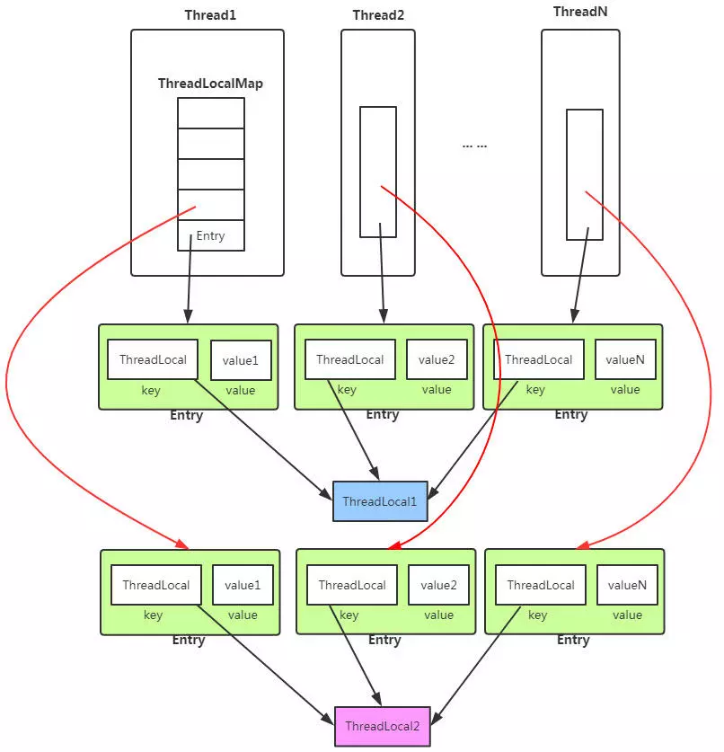
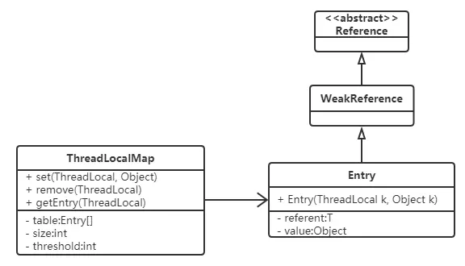
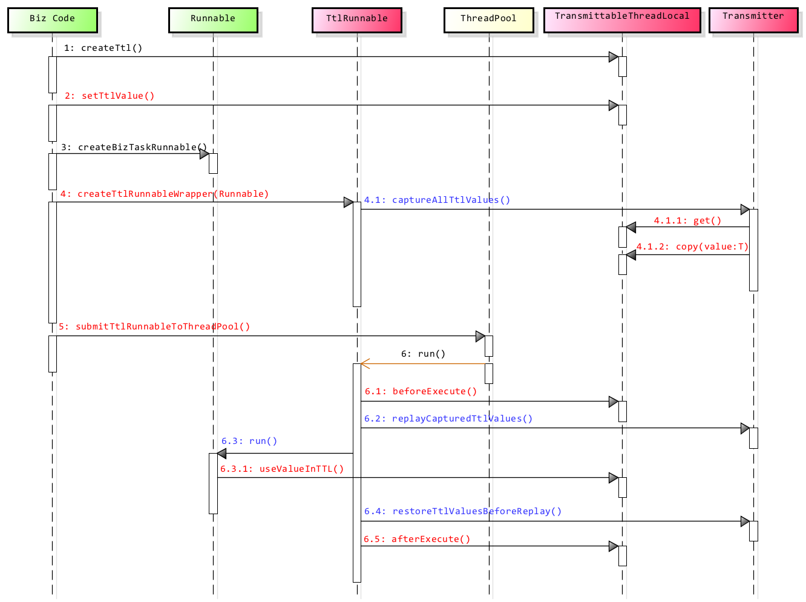
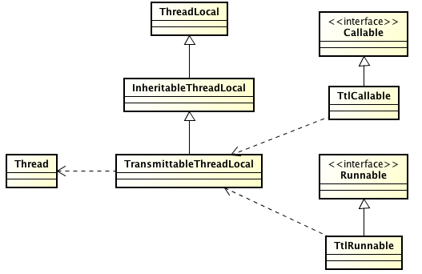

# ThreadLocal

## 结构图



`ThreadLocal`的实现是这样的：每个`Thread` 维护一个 `ThreadLocalMap` 映射表，这个映射表的 `key` 是 `ThreadLocal` 实例本身，`value` 是真正需要存储的 `Object`。

也就是说 `ThreadLocal` 本身并不存储值，它只是作为一个 `key` 来让线程从 `ThreadLocalMap` 获取 `value`。

Thread线程内部的 `ThreadLocalMap` 在类中描述如下：

```java
public class Thread implements Runnable {

    /* ThreadLocal values pertaining to this thread. This map is maintained
     * by the ThreadLocal class. */
    ThreadLocal.ThreadLocalMap threadLocals = null;
}
```


## 源码分析

### set()方法

```java
/**
 * Sets the current thread's copy of this thread-local variable
 * to the specified value.  Most subclasses will have no need to
 * override this method, relying solely on the {@link #initialValue}
 * method to set the values of thread-locals.
 *
 * @param value the value to be stored in the current thread's copy of
 *        this thread-local.
 */
public void set(T value) {
    Thread t = Thread.currentThread();
    ThreadLocalMap map = getMap(t);
    if (map != null)
        map.set(this, value);
    else
        createMap(t, value);
}

ThreadLocalMap getMap(Thread t) {
    return t.threadLocals;
}

void createMap(Thread t, T firstValue) {
    t.threadLocals = new ThreadLocalMap(this, firstValue);
}
```

步骤：

1. 根据当前线程获取到ThreadLocalMap（如果ThreadLocalMap不存在，就创建一个实例）
2. 以当前threadlocal对象为key保存到ThreadLocalMap中

### get()方法

```java
/**
 * Returns the value in the current thread's copy of this
 * thread-local variable.  If the variable has no value for the
 * current thread, it is first initialized to the value returned
 * by an invocation of the {@link #initialValue} method.
 *
 * @return the current thread's value of this thread-local
 */
public T get() {
    Thread t = Thread.currentThread();
    ThreadLocalMap map = getMap(t);
    if (map != null) {
        ThreadLocalMap.Entry e = map.getEntry(this);
        if (e != null)
            return (T)e.value;
    }
    return setInitialValue();
}

ThreadLocalMap getMap(Thread t) {
    return t.threadLocals;
}

private T setInitialValue() {
    T value = initialValue();
    Thread t = Thread.currentThread();
    ThreadLocalMap map = getMap(t);
    if (map != null)
        map.set(this, value);
    else
        createMap(t, value);
    return value;
}

protected T initialValue() {
    return null;
}

void createMap(Thread t, T firstValue) {
    t.threadLocals = new ThreadLocalMap(this, firstValue);
}
```

步骤：

1. 根据当前线程获取到ThreadLocalMap（如果ThreadLocalMap不存在，就创建一个实例）
2. 从ThreadLocalMap中获取当前thradlocal对象对应的value

### remove()方法

```java
/**
 * Removes the current thread's value for this thread-local
 * variable.  If this thread-local variable is subsequently
 * {@linkplain #get read} by the current thread, its value will be
 * reinitialized by invoking its {@link #initialValue} method,
 * unless its value is {@linkplain #set set} by the current thread
 * in the interim.  This may result in multiple invocations of the
 * <tt>initialValue</tt> method in the current thread.
 *
 * @since 1.5
 */
public void remove() {
 ThreadLocalMap m = getMap(Thread.currentThread());
 if (m != null)
     m.remove(this);
}

ThreadLocalMap getMap(Thread t) {
    return t.threadLocals;
}
```

步骤：

- 略。

### ThreadLocalMap

ThreadLocalMap是ThreadLocal的内部类，没有实现Map接口，用独立的方式实现了Map的功能，其内部的Entry也独立实现。



在ThreadLocalMap中，也是用Entry来保存K-V结构数据的。但是Entry中key只能是ThreadLocal对象，这点被Entry的构造方法已经限定死了。

```java
static class Entry extends WeakReference<ThreadLocal> {
    /** The value associated with this ThreadLocal. */
    Object value;

    Entry(ThreadLocal k, Object v) {
        super(k);
        value = v;
    }
}
```

Entry继承自WeakReference（弱引用，生命周期只能存活到下次GC前），但只有Key是弱引用类型的，Value并非弱引用。

#### Hash冲突怎么解决

ThreadLocalMap中解决Hash冲突的方式是采用线性探测的方式，所谓线性探测，就是根据初始key的hashcode值确定元素在table数组中的位置，如果发现这个位置上已经有其他key值的元素被占用，则利用固定的算法寻找一定步长的下个位置，依次判断，直至找到能够存放的位置。

ThreadLocalMap解决Hash冲突的方式就是简单的步长加1或减1，寻找下一个相邻的位置。

```java
private void set(ThreadLocal<?> key, Object value) {
    Entry[] tab = table;
    int len = tab.length;
    int i = key.threadLocalHashCode & (len-1);

    for (Entry e = tab[i];
         e != null;
         e = tab[i = nextIndex(i, len)]) {
        ThreadLocal<?> k = e.get();

        if (k == key) {
            e.value = value;
            return;
        }

        if (k == null) {
            replaceStaleEntry(key, value, i);
            return;
        }
    }

    tab[i] = new Entry(key, value);
    int sz = ++size;
    if (!cleanSomeSlots(i, sz) && sz >= threshold)
        rehash();
}

private static int nextIndex(int i, int len) {
    return ((i + 1 < len) ? i + 1 : 0);
}
```

显然ThreadLocalMap采用线性探测的方式解决Hash冲突的效率很低，如果有大量不同的ThreadLocal对象放入map中时发送冲突，或者发生二次冲突，则效率很低。

#### 为什么使用弱引用

分两种情况讨论：

- **key 使用强引用**：引用的`ThreadLocal`的对象被回收了，但是`ThreadLocalMap`还持有`ThreadLocal`的强引用，如果没有手动删除，`ThreadLocal`不会被回收，导致`Entry`内存泄漏。
- **key 使用弱引用**：引用的`ThreadLocal`的对象被回收了，由于`ThreadLocalMap`持有`ThreadLocal`的弱引用，即使没有手动删除，`ThreadLocal`也会被回收。`value`在下一次`ThreadLocalMap`调用`set`,`get`，`remove`的时候会被清除。

比较两种情况，我们可以发现：由于`ThreadLocalMap`的生命周期跟`Thread`一样长，如果都没有手动删除对应`key`，都会导致内存泄漏，但是使用弱引用可以多一层保障：**弱引用ThreadLocal不会内存泄漏，对应的value在下一次ThreadLocalMap调用set,get,remove的时候会被清除**。

1. get方法

   在get的过程中，如果遇到某槽位满足一下条件:`table[i]!=null && table[i].get()==null`，就清理该槽位`expungeStaleEntry(i)`

```java
private Entry getEntry(ThreadLocal<?> key) {
    int i = key.threadLocalHashCode & (table.length - 1);
    Entry e = table[i];
    if (e != null && e.get() == key)
        return e;
    else
        return getEntryAfterMiss(key, i, e);
}
private Entry getEntryAfterMiss(ThreadLocal<?> key, int i, Entry e) {
    Entry[] tab = table;
    int len = tab.length;

    while (e != null) {
        ThreadLocal<?> k = e.get();
        if (k == key)
            return e;
        if (k == null)
            expungeStaleEntry(i);
        else
            i = nextIndex(i, len);
        e = tab[i];
    }
    return null;
}
/**
* Expunge a stale entry by rehashing any possibly colliding entries
* lying between staleSlot and the next null slot.  This also expunges
* any other stale entries encountered before the trailing null.
* 清理指定的槽位 + rehash
**/
private int expungeStaleEntry(int staleSlot) {
    Entry[] tab = table;
    int len = tab.length;

    // expunge entry at staleSlot
    tab[staleSlot].value = null;
    tab[staleSlot] = null;
    size--;

    // Rehash until we encounter null
    Entry e;
    int i;
    for (i = nextIndex(staleSlot, len);
         (e = tab[i]) != null;
         i = nextIndex(i, len)) {
        ThreadLocal<?> k = e.get();
        if (k == null) {
            e.value = null;
            tab[i] = null;
            size--;
        } else {
            int h = k.threadLocalHashCode & (len - 1);
            if (h != i) {
                tab[i] = null;

                // Unlike Knuth 6.4 Algorithm R, we must scan until
                // null because multiple entries could have been stale.
                while (tab[h] != null)
                    h = nextIndex(h, len);
                tab[h] = e;
            }
        }
    }
    return i;
}
```

2. remove方法

   在remove的过程中，如果遇到某槽位满足一下条件:`table[i]!=null && table[i].get()==null`，就清理该槽位`expungeStaleEntry(i)`

   ```java
   private void remove(ThreadLocal<?> key) {
       Entry[] tab = table;
       int len = tab.length;
       int i = key.threadLocalHashCode & (len-1);
       for (Entry e = tab[i];
            e != null;
            e = tab[i = nextIndex(i, len)]) {
           if (e.get() == key) {
               e.clear();
               expungeStaleEntry(i);
               return;
           }
       }
   }
   ```

3. set方法

   在set的过程中：

   - 如果遇到某槽位满足一下条件:`table[i]!=null && table[i].get()==null`，就替换掉该槽位的值`replaceStaleEntry(i)`

   - 在找到一个空的槽位，把（key，value）放在该槽位里面后，后触发`cleanSomeSlots`

     ```java
     private boolean cleanSomeSlots(int i, int n) {
         boolean removed = false;
         Entry[] tab = table;
         int len = tab.length;
         do {
             i = nextIndex(i, len);
             Entry e = tab[i];
             if (e != null && e.get() == null) {
                 n = len;
                 removed = true;
                 i = expungeStaleEntry(i);
             }
         } while ( (n >>>= 1) != 0);
         return removed;
     }
     ```

因此，`ThreadLocal`内存泄漏的根源是：由于`ThreadLocalMap`的生命周期跟`Thread`一样长，如果没有手动删除对应`key`就会导致内存泄漏，而不是因为弱引用。

# InheritableThreadLocal

## 源码

```java
public class InheritableThreadLocal<T> extends ThreadLocal<T> {
    /**
     * Computes the child's initial value for this inheritable thread-local
     * variable as a function of the parent's value at the time the child
     * thread is created.  This method is called from within the parent
     * thread before the child is started.
     */
    protected T childValue(T parentValue) {
        return parentValue;
    }
    ThreadLocalMap getMap(Thread t) {
       return t.inheritableThreadLocals;
    }
    void createMap(Thread t, T firstValue) {
        t.inheritableThreadLocals = new ThreadLocalMap(this, firstValue);
    }
}
```

从上述源码可知:InheritableThreadLocal对于的ThreadLocalMap是放在`thread.inheritableThreadLocals`属性中的，与ThreadLocal不同。

## 拷贝实现

ThreadLocal的拷贝发生在：当前线程生成子线程实例的时候。如果当前线程的inheritableThreadLocals属性不为空，就会把该属性拷贝到子线程的inheritableThreadLocals属性中

```java
public Thread() {
    init(null, null, "Thread-" + nextThreadNum(), 0);
}
private void init(ThreadGroup g, Runnable target, String name, long stackSize) {
    init(g, target, name, stackSize, null, true);
}
private void init(....) {
  	......
  	Thread parent = currentThread();
    ......
    if (inheritThreadLocals && parent.inheritableThreadLocals != null)
        this.inheritableThreadLocals =
            ThreadLocal.createInheritedMap(parent.inheritableThreadLocals);
    ......
}
```


```java
static ThreadLocalMap createInheritedMap(ThreadLocalMap parentMap) {
    return new ThreadLocalMap(parentMap);
}
private ThreadLocalMap(ThreadLocalMap parentMap) {
    Entry[] parentTable = parentMap.table;
    int len = parentTable.length;
    setThreshold(len);
    table = new Entry[len];

    for (int j = 0; j < len; j++) {
        Entry e = parentTable[j];
        if (e != null) {
            @SuppressWarnings("unchecked")
            ThreadLocal<Object> key = (ThreadLocal<Object>) e.get();
            if (key != null) {
                Object value = key.childValue(e.value);
              	// 注意： key和value的拷贝都是浅拷贝
                Entry c = new Entry(key, value);
                int h = key.threadLocalHashCode & (len - 1);
                while (table[h] != null)
                    h = nextIndex(h, len);
                table[h] = c;
                size++;
            }
        }
    }
}
```

# TransmittableThreadLocal

## 概述

`JDK`的[`InheritableThreadLocal`](https://docs.oracle.com/javase/10/docs/api/java/lang/InheritableThreadLocal.html)类可以完成父线程到子线程的值传递。但对于使用线程池等会池化复用线程的组件的情况，线程由线程池创建好，并且线程是池化起来反复使用的；这时父子线程关系的`ThreadLocal`值传递已经没有意义，应用需要的实际上是把 **任务提交给线程池时**的`ThreadLocal`值传递到 **任务执行时**。

[`TransmittableThreadLocal`](https://github.com/alibaba/transmittable-thread-local/blob/master/src/main/java/com/alibaba/ttl/TransmittableThreadLocal.java)类继承并加强[`InheritableThreadLocal`](https://docs.oracle.com/javase/10/docs/api/java/lang/InheritableThreadLocal.html)类，解决上述的问题。

相比[`InheritableThreadLocal`](https://docs.oracle.com/javase/10/docs/api/java/lang/InheritableThreadLocal.html)，添加了

1. `protected`方法`copy`
   用于定制 **任务提交给线程池时** 的`ThreadLocal`值传递到 **任务执行时** 的拷贝行为，缺省传递的是引用。
2. `protected`方法`beforeExecute`/`afterExecute`
   执行任务(`Runnable`/`Callable`)的前/后的生命周期回调，缺省是空操作。

### 整个过程的完整时序图



## demo:保证线程池中传递值

```java
public class Demo {
    public static void main(String[] args) throws Exception {
        final ExecutorService executorService = Executors.newSingleThreadExecutor();
        final TransmittableThreadLocal<String> ttl = new TransmittableThreadLocal<>();
        ttl.set("hello");

        executorService.submit(TtlRunnable.get(() -> System.out.println(ttl.get())));
        Thread.sleep(200);

        new Thread(
                () -> {
                    // 在new线程中，执行线程池操作
                    final TtlRunnable task = TtlRunnable.get(() -> System.out.println(ttl.get()));
                    executorService.submit(task);
                }
        ).start();
    }
}

// 输出结果：hello hello
```

## 拷贝实现



TransmittableThreadLocal 覆盖实现了 ThreadLocal 的 set、get、remove，实际存储 ThreadLocal 值的工作还是 ThreadLocal 父类完成，TransmittableThreadLocal 只是为每个使用它的 Thread 单独记录一份存储了哪些 TransmittableThreadLocal 对象。拿 set 来说就是这个样子：

```java
public final void set(T value) {
  super.set(value);
  if (null == value) removeValue();
  else addValue();
}
private void removeValue() {
    holder.get().remove(this);
}
private void addValue() {
    if (!holder.get().containsKey(this)) {
        holder.get().put(this, null); // WeakHashMap supports null value.
    }
}
private static InheritableThreadLocal<Map<TransmittableThreadLocal<?>, ?>> holder =
    new InheritableThreadLocal<Map<TransmittableThreadLocal<?>, ?>>() {
        @Override
        protected Map<TransmittableThreadLocal<?>, ?> initialValue() {
            return new WeakHashMap<TransmittableThreadLocal<?>, Object>();
        }

        @Override
        protected Map<TransmittableThreadLocal<?>, ?> childValue(Map<TransmittableThreadLocal<?>, ?> parentValue) {
            return new WeakHashMap<TransmittableThreadLocal<?>, Object>(parentValue);
        }
    };
```

TtlRunnable在装饰Runnable的时候，会把`TransmittableThreadLocal.holder`中的threadlocal以及其对于的value拷贝到`capturedRef`属性中，在子线程调用run方法的时候，把`capturedRef`复制到子线程中的threadlocal中。

```java
public final class TtlRunnable implements Runnable, TtlEnhanced {
    private final AtomicReference<Object> capturedRef;
    private final Runnable runnable;

    ......
    @Override
    public void run() {
        Object captured = capturedRef.get();
        if (captured == null || releaseTtlValueReferenceAfterRun && !capturedRef.compareAndSet(captured, null)) {
            throw new IllegalStateException("TTL value reference is released after run!");
        }

        Object backup = replay(captured);
        try {
            runnable.run();
        } finally {
            restore(backup);
        }
    }
    .....
}
```

# 参考

- [java并发--ThreadLocal原理]([https://zhangch.tech/2019/06/08/java%E5%B9%B6%E5%8F%91/java%E5%B9%B6%E5%8F%91--ThreadLocal%E5%8E%9F%E7%90%86/](https://zhangch.tech/2019/06/08/java并发/java并发--ThreadLocal原理/))
- [线程之间传递 ThreadLocal 对象](https://ylgrgyq.github.io/2017/09/25/transmittable-thread-local/)
- [TTL使用场景 与 设计实现解析的文章](https://github.com/alibaba/transmittable-thread-local/issues/123)
- [TTL的设计/使用/思考文档整理](https://github.com/alibaba/transmittable-thread-local/issues/21)

