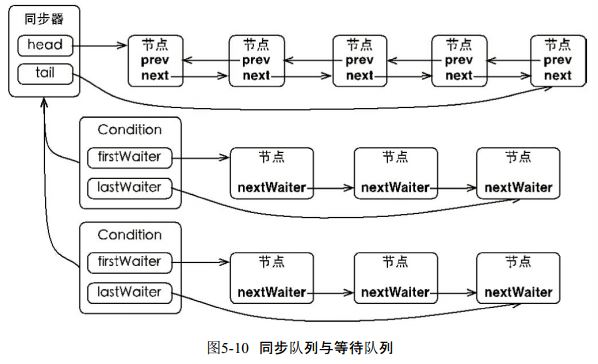
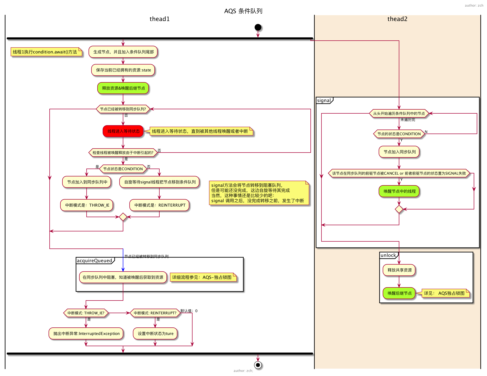
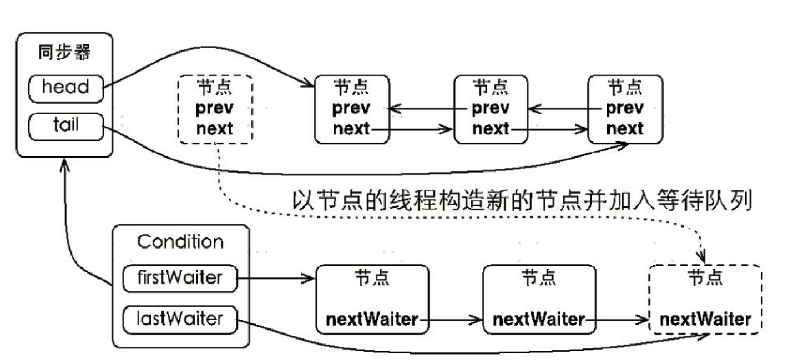
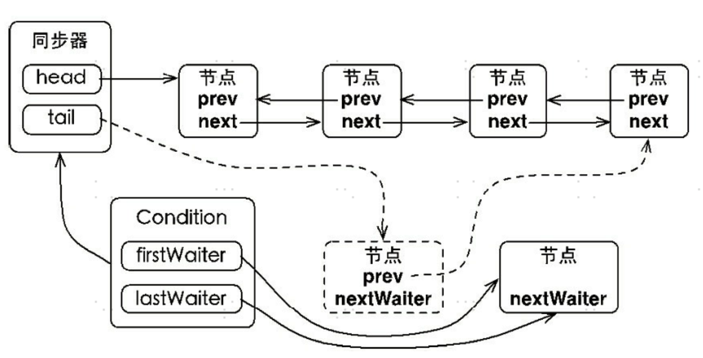

要看懂这个，必须要先看懂上一篇关于 `java并发--AQS【简介】`,`java并发--独占锁`的介绍，或者你已经有相关的知识了，否则这节肯定是看不懂的。

# Condition使用

我们先来看看 Condition 的使用场景，Condition 经常可以用在**生产者-消费者**的场景中，请看 Doug Lea 给出的这个例子：

```java
import java.util.concurrent.locks.Condition;
import java.util.concurrent.locks.Lock;
import java.util.concurrent.locks.ReentrantLock;

class ArrayBlockingQueue {
    final Lock lock = new ReentrantLock();
    // condition 依赖于 lock 来产生
    final Condition notFull = lock.newCondition();
    final Condition notEmpty = lock.newCondition();

    final Object[] items = new Object[100];
    int putptr, takeptr, count;

    // 生产
    public void put(Object x) throws InterruptedException {
        lock.lock();
        try {
            while (count == items.length)
                notFull.await();  // 队列已满，等待，直到 not full 才能继续生产
            items[putptr] = x;
            if (++putptr == items.length) putptr = 0;
            ++count;
            notEmpty.signal(); // 生产成功，队列已经 not empty 了，发个通知出去
        } finally {
            lock.unlock();
        }
    }

    // 消费
    public Object take() throws InterruptedException {
        lock.lock();
        try {
            while (count == 0)
                notEmpty.await(); // 队列为空，等待，直到队列 not empty，才能继续消费
            Object x = items[takeptr];
            if (++takeptr == items.length) takeptr = 0;
            --count;
            notFull.signal(); // 被我消费掉一个，队列 not full 了，发个通知出去
            return x;
        } finally {
            lock.unlock();
        }
    }
}
```

> 我们可以看到，在使用 condition 时，必须先持有相应的锁。这个和 Object 类中的方法有相似的语义，需要先持有某个对象的监视器锁才可以执行 wait(), notify() 或 notifyAll() 方法。
> obj.wait()，obj.notify() 或 obj.notifyAll() 是基于对象的监视器锁的。而这里说的 Condition 是基于 ReentrantLock 实现的， ReentrantLock 是依赖于 AbstractQueuedSynchronizer 实现的。

在往下看之前，读者心里要有一个整体的概念。condition 是依赖于 ReentrantLock  的，不管是调用 await 进入等待还是 signal 唤醒，**都必须获取到锁才能进行操作**。

# AQS中Condition的实现

每个 ReentrantLock  实例可以通过调用多次 newCondition 产生多个 ConditionObject 的实例：

```java
final ConditionObject newCondition() {
    // 实例化一个 ConditionObject
    return new ConditionObject();
}
```

我们首先来看下我们关注的 Condition 的实现类 `AbstractQueuedSynchronizer` 类中的 `ConditionObject`。

```java
public class ConditionObject implements Condition, java.io.Serializable {
        private static final long serialVersionUID = 1173984872572414699L;
        // 条件队列的第一个节点
        // 不要管这里的关键字 transient，是不参与序列化的意思
        private transient Node firstWaiter;
        // 条件队列的最后一个节点
        private transient Node lastWaiter;
        ......
```

在上一篇介绍 AQS 的时候，我们有一个**阻塞队列**，用于保存等待获取锁的线程的队列。这里我们引入另一个概念，叫**条件队列**（condition queue）。

> 这里的阻塞队列如果叫做同步队列（sync queue）其实比较贴切，不过为了和前篇呼应，我就继续使用阻塞队列了。记住这里的两个概念，**阻塞队列**和**条件队列**。



> 这里，我们简单回顾下 Node 的属性：
>
> ```java
> volatile int waitStatus; // 可取值 0、CANCELLED(1)、SIGNAL(-1)、CONDITION(-2)、PROPAGATE(-3)
> volatile Node prev;
> volatile Node next;
> volatile Thread thread;
> Node nextWaiter;
> ```
>
> prev 和 next 用于实现阻塞队列的双向链表，这里的 nextWaiter 用于实现条件队列的单向链表

基本上，把这张图看懂，你也就知道 condition 的处理流程了。所以，我先简单解释下这图，然后再具体地解释代码实现。

1. 条件队列和阻塞队列的节点，都是 Node 的实例，条件队列的节点是需要转移到阻塞队列中去的；
2. 我们知道一个 ReentrantLock 实例可以通过多次调用 newCondition() 来产生多个 Condition 实例。注意，ConditionObject 只有两个属性 firstWaiter 和 lastWaiter；
3. 每个 condition 有一个关联的**条件队列**，例如线程 1 调用 `condition1.await()` 方法即可将当前线程 1 包装成 Node 后加入到条件队列中，然后阻塞在这里，不继续往下执行，条件队列是一个单向链表；
4. 调用`condition1.signal()` 触发一次唤醒，此时唤醒的是队头，会将condition1 对应的**条件队列**的 firstWaiter（队头） 移到**阻塞队列的队尾**，等待获取锁，获取锁后 await 方法才能返回，继续往下执行。

上面的 2->3->4 描述了一个最简单的流程，没有考虑中断、signalAll、还有带有超时参数的 await 方法等，不过把这里弄懂是这节的主要目的。

## -1.线程await,signal流程图



## 0. 线程进入等待状态

接下来，我们一步步按照流程来走代码分析，我们先来看看 wait 方法：

```java
// 首先，这个方法是可被中断的，不可被中断的是另一个方法 awaitUninterruptibly()
// 这个方法会阻塞，直到调用 signal 方法（指 signal() 和 signalAll()，下同），或被中断
public final void await() throws InterruptedException {
    // 既然该方法要响应中断，那么在最开始就判断中断状态
    if (Thread.interrupted())
        throw new InterruptedException();

    // 添加到 condition 的条件队列中
    Node node = addConditionWaiter();

    // 释放锁，返回值是释放锁之前的 state 值（被唤醒后会恢复state值）
    int savedState = fullyRelease(node);

    int interruptMode = 0;
    // 这里退出循环有两种情况，之后再仔细分析
    // 1. isOnSyncQueue(node) 返回 true，即当前 node 已经转移到阻塞队列了
    // 2. checkInterruptWhileWaiting(node) != 0 会到 break，然后退出循环，代表的是线程中断
    while (!isOnSyncQueue(node)) {
        LockSupport.park(this);
        if ((interruptMode = checkInterruptWhileWaiting(node)) != 0)
            break;
    }
    // 被唤醒后，将进入阻塞队列，等待获取锁
    if (acquireQueued(node, savedState) && interruptMode != THROW_IE)
        interruptMode = REINTERRUPT;
    if (node.nextWaiter != null) // clean up if cancelled
        unlinkCancelledWaiters();
    if (interruptMode != 0)
        reportInterruptAfterWait(interruptMode);
}
```

其实，我大体上也把整个 await 过程说得十之八九了，下面我们分步把上面的几个点用源码说清楚。

## 1. 将节点加入到条件队列

addConditionWaiter() 是将当前节点加入到条件队列，这种条件队列内的操作是线程安全的。



```java
// 将当前线程对应的节点入队，插入队尾
private Node addConditionWaiter() {
    Node t = lastWaiter;
    // 如果条件队列的最后一个节点取消了，将其清除出去
    // 为什么这里把 waitStatus 不等于 Node.CONDITION，就判定为该节点发生了取消排队？取消等待的节点状态为:Node.CANCEL
    if (t != null && t.waitStatus != Node.CONDITION) {
        // 这个方法会遍历整个条件队列，然后会将已取消的所有节点清除出队列
        unlinkCancelledWaiters();
        t = lastWaiter;
    }
    // node 在初始化的时候，指定 waitStatus 为 Node.CONDITION
    Node node = new Node(Thread.currentThread(), Node.CONDITION);

    // t 此时是 lastWaiter，队尾
    // 如果队列为空
    if (t == null)
        firstWaiter = node;
    else
        t.nextWaiter = node;
    lastWaiter = node;
    return node;
}
```

上面的这块代码很简单，就是将当前线程进入到条件队列的队尾。

在addWaiter 方法中，有一个 unlinkCancelledWaiters() 方法，该方法用于清除队列中已经取消等待的节点。

当 await 的时候如果发生了取消操作（这点之后会说），或者是在节点入队的时候，发现最后一个节点是被取消的，会调用一次这个方法。

```java
// 等待队列是一个单向链表，遍历链表将已经取消等待的节点清除出去
// 纯属链表操作，很好理解，看不懂多看几遍就可以了
private void unlinkCancelledWaiters() {
    Node t = firstWaiter;
    Node trail = null;
    while (t != null) {
        Node next = t.nextWaiter;
        // 如果节点的状态不是 Node.CONDITION 的话，这个节点就是被取消的
        if (t.waitStatus != Node.CONDITION) {
            t.nextWaiter = null;
            if (trail == null)
                firstWaiter = next;
            else
                trail.nextWaiter = next;
            if (next == null)
                lastWaiter = trail;
        }
        else
            trail = t;
        t = next;
    }
}
```

## 2. 完全释放独占锁

回到 wait 方法，节点入队了以后，会调用 `int savedState = fullyRelease(node);` 方法释放锁，注意，这里是完全释放独占锁（fully release），因为 ReentrantLock 是可以重入的。

> 考虑一下这里的 savedState。如果在 condition1.await() 之前，假设线程先执行了 2 次 lock() 操作，那么 state 为 2，我们理解为该线程持有 2 把锁，这里 await() 方法必须将 state 设置为 0，然后再进入挂起状态，这样其他线程才能持有锁。当它被唤醒的时候，它需要重新持有 2 把锁，才能继续下去。

```java
// 首先，我们要先观察到返回值 savedState 代表 release 之前的 state 值
// 对于最简单的操作：先 lock.lock()，然后 condition1.await()。
//         那么 state 经过这个方法由 1 变为 0，锁释放，此方法返回 1
//         相应的，如果 lock 重入了 n 次，savedState == n
// 如果这个方法失败，会将节点设置为"取消"状态，并抛出异常 IllegalMonitorStateException
final int fullyRelease(Node node) {
    boolean failed = true;
    try {
        int savedState = getState();
        // 这里使用了当前的 state 作为 release 的参数，也就是完全释放掉锁，将 state 置为 0
        if (release(savedState)) {
            failed = false;
            return savedState;
        } else {
            throw new IllegalMonitorStateException();
        }
    } finally {
        if (failed)
            node.waitStatus = Node.CANCELLED;
    }
}
```

> 考虑一下，如果一个线程在不持有 lock 的基础上，就去调用 condition1.await() 方法，它能进入条件队列，但是在上面的这个方法中，由于它不持有锁，release(savedState) 这个方法肯定要返回 false，进入到异常分支，然后进入 finally 块设置 `node.waitStatus = Node.CANCELLED`，这个已经入队的节点之后会被后继的节点”请出去“。

## 3. 等待进入阻塞队列

释放掉锁以后，接下来是这段，这边会自旋，如果发现自己还没到阻塞队列，那么挂起，等待被转移到阻塞队列。

```java
int interruptMode = 0;
// 如果不在阻塞队列中，注意了，是阻塞队列
while (!isOnSyncQueue(node)) {
    // 线程挂起
    LockSupport.park(this);

    // 这里可以先不用看了，等看到它什么时候被 unpark 再说
    if ((interruptMode = checkInterruptWhileWaiting(node)) != 0)
        break;
}
```

isOnSyncQueue(Node node) 用于判断节点是否已经转移到阻塞队列了：

```java
// signal 的时候需要将节点从条件队列移到阻塞队列，这个方法就是判断 node 是否已经移动到阻塞队列了
final boolean isOnSyncQueue(Node node) {

    // 移动过去的时候，node 的 waitStatus 会置为 0(这个之后在说 signal 方法的时候会说到)
    // 1.如果 waitStatus 还是 Node.CONDITION，也就是 -2，那肯定就是还在条件队列中
    // 2.如果 node 的前驱 prev 指向还是 null，说明肯定没有在 阻塞队列(prev是阻塞队列链表中使用的)
    if (node.waitStatus == Node.CONDITION || node.prev == null)
        return false;
    // 如果 node 已经有后继节点 next 的时候，那肯定是在阻塞队列了
    if (node.next != null) 
        return true;

    // 下面这个方法从阻塞队列的队尾开始从后往前遍历找，如果找到相等的，说明在阻塞队列，否则就是不在阻塞队列

    // 可以通过判断 node.prev() != null 来推断出 node 在阻塞队列吗？答案是：不能。
    // 这个可以看 AQS 的入队方法--enq()，首先设置的是 node.prev 指向 tail，
    // 然后是 CAS 操作将自己设置为新的 tail，可是这次的 CAS 是可能失败的。
    return findNodeFromTail(node);
}

// 从阻塞队列的队尾往前遍历，如果找到，返回 true
private boolean findNodeFromTail(Node node) {
    Node t = tail;
    for (;;) {
        if (t == node)
            return true;
        if (t == null)
            return false;
        t = t.prev;
    }
}
```

回到前面的循环，isOnSyncQueue(node) 返回 false 的话，那么进到 `LockSupport.park(this);` 这里线程挂起。

## 4. signal 唤醒线程，转移到阻塞队列

为了大家理解，这里我们先看唤醒操作，因为刚刚到 `LockSupport.park(this);` 把线程挂起了，等待唤醒。



```java
// 唤醒等待了最久的线程
// 其实就是，将这个线程对应的 node 从条件队列转移到阻塞队列
public final void signal() {
    // 调用 signal 方法的线程必须持有当前的独占锁
    if (!isHeldExclusively())
        throw new IllegalMonitorStateException();
    Node first = firstWaiter;
    if (first != null)
        doSignal(first);
}

// 从条件队列队头往后遍历，找出第一个需要转移的 node
// 因为前面我们说过，有些线程会取消排队，但是可能还在队列中
private void doSignal(Node first) {
    do {
          // 将 firstWaiter 指向 first 节点后面的第一个，因为 first 节点马上要离开了
        // 如果将 first 移除后，后面没有节点在等待了，那么需要将 lastWaiter 置为 null
        if ( (firstWaiter = first.nextWaiter) == null)
            lastWaiter = null;
        // 因为 first 马上要被移到阻塞队列了，和条件队列的链接关系在这里断掉
        first.nextWaiter = null;
    } while (!transferForSignal(first) &&
             (first = firstWaiter) != null);
      // 这里 while 循环，如果 first 转移不成功，那么选择 first 后面的第一个节点进行转移，依此类推
}

// 将节点从条件队列转移到阻塞队列
// true 代表成功转移
// false 代表在 signal 之前，节点已经取消了
final boolean transferForSignal(Node node) {

    // CAS 如果失败，说明此 node 的 waitStatus 已不是 Node.CONDITION，说明节点已经取消，
    // 既然已经取消，也就不需要转移了，方法返回，转移后面一个节点
    // 否则，将 waitStatus 置为 0
    if (!compareAndSetWaitStatus(node, Node.CONDITION, 0))
        return false;

    // enq(node): 自旋进入阻塞队列的队尾
    // 注意，这里的返回值 p 是 node 在阻塞队列的前驱节点
    Node p = enq(node);
    int ws = p.waitStatus;
    // ws > 0 说明 node 在阻塞队列中的前驱节点取消了等待锁，直接唤醒 node 对应的线程。唤醒之后会怎么样，后面再解释
    // 如果 ws <= 0, 那么 compareAndSetWaitStatus 将会被调用，上篇介绍的时候说过，节点入队后，需要把前驱节点的状态设为 Node.SIGNAL(-1)
    if (ws > 0 || !compareAndSetWaitStatus(p, ws, Node.SIGNAL))
        // 如果前驱节点取消或者 CAS 失败，会进到这里唤醒线程，之后的操作看下一节
        LockSupport.unpark(node.thread);
    return true;
}
```

正常情况下，`ws > 0 || !compareAndSetWaitStatus(p, ws, Node.SIGNAL)` 这句中，ws <= 0，而且 `compareAndSetWaitStatus(p, ws, Node.SIGNAL)` 会返回 true，所以一般也不会进去 if 语句块中唤醒 node 对应的线程。然后这个方法返回 true，也就意味着 signal 方法结束了，节点进入了阻塞队列。

假设发生了阻塞队列中的前驱节点取消等待，或者 CAS 失败，只要唤醒线程，让其进到下一步即可。

## 5. 唤醒后检查中断状态

上一步 signal 之后，我们的线程由条件队列转移到了阻塞队列，之后就准备获取锁了。只要重新获取到锁了以后，继续往下执行。

等线程从挂起中恢复过来，继续往下看

```java
int interruptMode = 0;
while (!isOnSyncQueue(node)) {
    // 线程挂起
    LockSupport.park(this);

    if ((interruptMode = checkInterruptWhileWaiting(node)) != 0)
        break;
}
```

先解释下 interruptMode。interruptMode 可以取值为 REINTERRUPT（1），THROW_IE（-1），0

- REINTERRUPT： 代表 await 返回的时候，需要重新设置中断状态
- THROW_IE： 代表 await 返回的时候，需要抛出 InterruptedException 异常
- 0 ：说明在 await 期间，没有发生中断

有以下三种情况会`unpark`，让 `LockSupport.park(this); `这句返回：

1. 常规路径。lock->signal ->转移节点到阻塞队列 -> unlock(release->unparkSuccessor->unpark，在unlock的时候会唤醒被park的线程)
2. 线程中断。在 park 的时候，另外一个线程对这个线程进行了中断
3. signal 的时候我们说过，转移以后的前驱节点取消了，或者对前驱节点的CAS操作失败了
4. 假唤醒。这个也是存在的，和 Object.wait() 类似，都有这个问题

线程唤醒后第一步是调用 checkInterruptWhileWaiting(node) 这个方法，此方法用于判断是否在线程挂起期间发生了中断，如果发生了中断，是 signal 调用之前中断的，还是 signal 之后发生的中断。

```java
// 1. 如果在 signal 之前已经中断，返回 THROW_IE
// 2. 如果是 signal 之后中断，返回 REINTERRUPT
// 3. 没有发生中断，返回 0
private int checkInterruptWhileWaiting(Node node) {
    return Thread.interrupted() ?
        (transferAfterCancelledWait(node) ? THROW_IE : REINTERRUPT) :
        0;
}
```

> Thread.interrupted()：如果当前线程已经处于中断状态，那么该方法返回 true，同时将中断状态重置为 false，所以，才有后续的 `重新中断（REINTERRUPT）` 的使用。

看看怎么判断是 signal 之前还是之后发生的中断：

```java
// 只有线程处于中断状态，才会调用此方法
// 如果需要的话，将这个已经取消等待的节点转移到阻塞队列
// 返回 true：如果此线程在 signal 之前被取消，
final boolean transferAfterCancelledWait(Node node) {
    // 用 CAS 将节点状态设置为 0 
    // 如果这步 CAS 成功，说明是 signal 方法之前发生的中断，因为如果 signal 先发生的话，signal 中会将 waitStatus 设置为 0
    if (compareAndSetWaitStatus(node, Node.CONDITION, 0)) {
        // 将节点放入阻塞队列
        // 这里我们看到，即使中断了，依然会转移到阻塞队列
        enq(node);
        return true;
    }

    // 到这里是因为 CAS 失败，肯定是因为 signal 方法已经将 waitStatus 设置为了 0
    // signal 方法会将节点转移到阻塞队列，但是可能还没完成，这边自旋等待其完成
    // 当然，这种事情还是比较少的吧：signal 调用之后，没完成转移之前，发生了中断
    while (!isOnSyncQueue(node))
        Thread.yield();
    return false;
}
```

> 这里再说一遍，即使发生了中断，节点依然会转移到阻塞队列。

到这里，大家应该都知道这个 while 循环怎么退出了吧。要么中断，要么转移成功。

这里描绘了一个场景，本来有个线程，它是排在条件队列的后面的，但是因为它被中断了，那么它会被唤醒，然后它发现自己不是被 signal 的那个，但是它会自己主动去进入到阻塞队列。

## 6. 获取独占锁

while 循环出来以后，下面是这段代码：

```java
if (acquireQueued(node, savedState) && interruptMode != THROW_IE)
    interruptMode = REINTERRUPT;
```

由于 while 出来后，我们确定节点已经进入了阻塞队列，准备获取锁。

这里的 acquireQueued(node, savedState) 的第一个参数 node 之前已经经过 enq(node) 进入了队列，参数 savedState 是之前释放锁前的 state，这个方法返回的时候，代表当前线程获取了锁，而且 state == savedState了。

注意，前面我们说过，不管有没有发生中断，都会进入到阻塞队列，而 acquireQueued(node, savedState) 的返回值就是代表线程是否被中断。如果返回 true，说明被中断了，而且 interruptMode != THROW_IE，说明在 signal 之前就发生中断了，这里将 interruptMode 设置为 REINTERRUPT，用于待会重新中断。

继续往下：

```java
if (node.nextWaiter != null) // clean up if cancelled
    unlinkCancelledWaiters();
if (interruptMode != 0)
    reportInterruptAfterWait(interruptMode);
```

本着一丝不苟的精神，这边说说 `node.nextWaiter != null` 怎么满足。我前面也说了 signal 的时候会将节点转移到阻塞队列，有一步是 node.nextWaiter = null，将断开节点和条件队列的联系。

可是，`在判断发生中断的情况下，是 signal 之前还是之后发生的？` 这部分的时候，我也介绍了，如果 signal 之前就中断了，也需要将节点进行转移到阻塞队列，这部分转移的时候，是没有设置 node.nextWaiter = null 的。

之前我们说过，如果有节点取消，也会调用 unlinkCancelledWaiters 这个方法，就是这里了。

## 7. 处理中断状态

到这里，我们终于可以好好说下这个 interruptMode 干嘛用了。

- 0：什么都不做，没有被中断过；
- THROW_IE：await 方法抛出 InterruptedException 异常，因为它代表在 await() 期间发生了中断；
- REINTERRUPT：重新中断当前线程，因为它代表 await() 期间没有被中断，而是 signal() 以后发生的中断

```java
private void reportInterruptAfterWait(int interruptMode)
    throws InterruptedException {
    if (interruptMode == THROW_IE)
        throw new InterruptedException();
    else if (interruptMode == REINTERRUPT)
        selfInterrupt();
}
```

> 这个中断状态这部分内容，大家应该都理解了吧，不理解的话，多看几遍就是了。

## * 带超时机制的 await

经过前面的 7 步，整个 ConditionObject 类基本上都分析完了，接下来简单分析下带超时机制的 await 方法。

```java
public final long awaitNanos(long nanosTimeout) 
                  throws InterruptedException
public final boolean awaitUntil(Date deadline)
                throws InterruptedException
public final boolean await(long time, TimeUnit unit)
                throws InterruptedException
```

这三个方法都差不多，我们就挑一个出来看看吧：

```java
public final boolean await(long time, TimeUnit unit)
        throws InterruptedException {
    // 等待这么多纳秒
    long nanosTimeout = unit.toNanos(time);
    if (Thread.interrupted())
        throw new InterruptedException();
    Node node = addConditionWaiter();
    int savedState = fullyRelease(node);
    // 当前时间 + 等待时长 = 过期时间
    final long deadline = System.nanoTime() + nanosTimeout;
    // 用于返回 await 是否超时
    boolean timedout = false;
    int interruptMode = 0;
    while (!isOnSyncQueue(node)) {
        // 时间到啦
        if (nanosTimeout <= 0L) {
            // 这里因为要 break 取消等待了。取消等待的话一定要调用 transferAfterCancelledWait(node) 这个方法
            // 如果这个方法返回 true，在这个方法内，将节点转移到阻塞队列成功
            // 返回 false 的话，说明 signal 已经发生，signal 方法将节点转移了。也就是说没有超时嘛
            timedout = transferAfterCancelledWait(node);
            break;
        }
        // 常量spinForTimeoutThreshold 的值是 1000 纳秒，也就是 1 毫秒
        // 也就是说，如果不到 1 毫秒了，那就不要选择 parkNanos 了，自旋的性能反而更好
        if (nanosTimeout >= spinForTimeoutThreshold)
            LockSupport.parkNanos(this, nanosTimeout);
        if ((interruptMode = checkInterruptWhileWaiting(node)) != 0)
            break;
        // 得到剩余时间
        nanosTimeout = deadline - System.nanoTime();
    }
    if (acquireQueued(node, savedState) && interruptMode != THROW_IE)
        interruptMode = REINTERRUPT;
    if (node.nextWaiter != null)
        unlinkCancelledWaiters();
    if (interruptMode != 0)
        reportInterruptAfterWait(interruptMode);
    return !timedout;
}
```

超时的思路还是很简单的，不带超时参数的 await 是 park，然后等待别人唤醒。而现在就是调用 parkNanos 方法来休眠指定的时间，醒来后判断是否 signal 调用了，调用了就是没有超时，否则就是超时了。超时的话，自己来进行转移到阻塞队列，然后抢锁。

## * 不抛出 InterruptedException 的 await

关于 Condition 最后一小节了。

```java
public final void awaitUninterruptibly() {
    Node node = addConditionWaiter();
    int savedState = fullyRelease(node);
    boolean interrupted = false;
    while (!isOnSyncQueue(node)) {
        LockSupport.park(this);
        if (Thread.interrupted())
            interrupted = true;
    }
    if (acquireQueued(node, savedState) || interrupted)
        selfInterrupt();
}
```

很简单，贴一下代码大家就都懂了，我就不废话了。

# 参考

- 原文: [一行一行源码分析清楚 AbstractQueuedSynchronizer (二)]([https://www.javadoop.com/post/AbstractQueuedSynchronizer-2#%E5%85%AC%E5%B9%B3%E9%94%81%E5%92%8C%E9%9D%9E%E5%85%AC%E5%B9%B3%E9%94%81](https://www.javadoop.com/post/AbstractQueuedSynchronizer-2#公平锁和非公平锁))
- 这篇也不错: [逐行分析AQS源码(4)——Condition接口实现](https://segmentfault.com/a/1190000016462281)