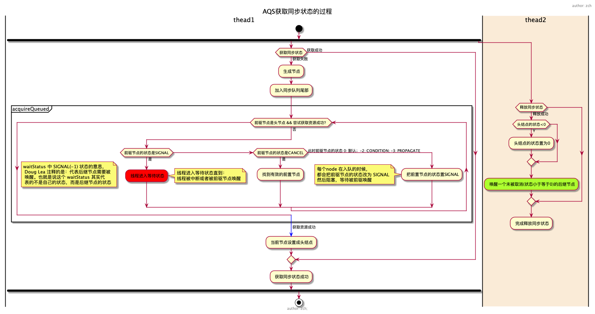

# 独占锁

`ReentrantLock`的内部类`FairSync`,`NonfairSync`都是`AQS`的独占锁实现

获取资源与释放资源的流程图如下：



## 公平锁加锁

AQS大多数情况下都是通过继承来使用的, 子类通过覆写 `tryAcquire` 来实现自己的获取锁的逻辑，我们这里以ReentrantLock为例来说明锁的获取流程。

这里直接以 `FairLock` 为例, 来逐行分析锁的获取:

```java
static final class FairSync extends Sync {
    private static final long serialVersionUID = -3000897897090466540L;
    //获取锁
    final void lock() {
        acquire(1);
    }
    ...
}
```

lock 方法调用的 `acquire`方法来自父类AQS。

### acquire

acquire 定义在AQS类中，描述了获取锁的流程

```java
public final void acquire(int arg) {
    if (!tryAcquire(arg) && acquireQueued(addWaiter(Node.EXCLUSIVE), arg))
        selfInterrupt();
}
```

可以看出, 该方法中涉及了四个方法的调用:

- **（1）tryAcquire(arg)**
该方法由继承AQS的子类实现, 为获取锁的具体逻辑。

- **（2）addWaiter(Node mode)**
该方法由AQS实现, 负责在获取锁失败后调用, 将当前请求锁的线程包装成Node扔到sync queue中去，并返回这个Node。

- **（3）acquireQueued(final Node node, int arg)**
  该方法由AQS实现,这个方法比较复杂, 主要对上面刚加入队列的Node不断尝试以下两种操作之一:

  - 在前驱节点就是head节点的时候,继续尝试获取锁
  - 将当前线程挂起,使CPU不再调度它
  
- **（4）selfInterrupt**

  该方法由AQS实现, 用于中断当前线程。由于在整个抢锁过程中，我们都是不响应中断的。那如果在抢锁的过程中发生了中断怎么办呢，总不能假装没看见呀。AQS的做法简单的记录有没有有发生过中断，如果返回的时候发现曾经发生过中断，则在退出`acquire`方法之前，就调用`selfInterrupt`自我中断一下，就好像将这个发生在抢锁过程中的中断“推迟”到抢锁结束以后再发生一样。

从上面的简单介绍中可以看出，除了获取锁的逻辑 `tryAcquire(arg)`由子类实现外, 其余方法均由AQS实现。

接下来我们重点来看 `FairSync` 所实现的获取锁的逻辑:

### tryAcquire

`tryAcquire` 获取锁的逻辑其实很简单——判断当前锁有没有被占用：

1. 如果锁没有被占用, 尝试以公平的方式获取锁
2. 如果锁已经被占用, 检查是不是锁重入

获取锁成功返回`true`, 失败则返回`false`

```java
protected final boolean tryAcquire(int acquires) {
    final Thread current = Thread.currentThread();
    // 首先获取当前锁的状态
    int c = getState(); 
    
    // c=0 说明当前锁是avaiable的, 没有被任何线程占用, 可以尝试获取
    // 因为是实现公平锁, 所以在抢占之前首先看看队列中有没有排在自己前面的Node
    // 如果没有人在排队, 则通过CAS方式获取锁, 就可以直接退出了
    if (c == 0) {
        if (!hasQueuedPredecessors() 
        /* 为了阅读方便, hasQueuedPredecessors源码就直接贴在这里了, 这个方法的本质实际上是检测自己是不是head节点的后继节点，即处在阻塞队列第一位的节点
            public final boolean hasQueuedPredecessors() {
                Node t = tail; 
                Node h = head;
                Node s;
                return h != t && ((s = h.next) == null || s.thread != Thread.currentThread());
            }
        */
        && compareAndSetState(0, acquires)) {
            setExclusiveOwnerThread(current); // 将当前线程设置为占用锁的线程
            return true;
        }
    }
    
    // 如果 c>0 说明锁已经被占用了
    // 对于可重入锁, 这个时候检查占用锁的线程是不是就是当前线程,是的话,说明已经拿到了锁, 直接重入就行
    else if (current == getExclusiveOwnerThread()) {
        int nextc = c + acquires;
        if (nextc < 0)
            throw new Error("Maximum lock count exceeded");
        setState(nextc);
        /* setState方法如下：
        protected final void setState(int newState) {
            state = newState;
        }
        */
        return true;
    }
    
    // 到这里说明有人占用了锁, 并且占用锁的不是当前线程, 则获取锁失败
    return false;
}
```

从这里可以看出，获取锁其实主要就是干一件事：

> 将state的状态通过CAS操作实现+1操作

由于是CAS操作，必然是只有一个线程能执行成功。则执行成功的线程即获取了锁，在这之后，才有权利将`exclusiveOwnerThread`的值设成自己，从而“坐上铁王座”。
另外对于可重入锁，如果当前线程已经是获取了锁的线程了，它还要注意增加锁的重入次数。

值得一提的是，这里修改state状态的操作，一个用了CAS方法`compareAndSetState`，一个用了普通的`setState`方法。这是因为用CAS操作时，当前线程还没有获得锁，所以可能存在多线程同时在竞争锁的情况；而调用setState方法时，是在当前线程已经是持有锁的情况下，因此对state的修改是安全的，只需要普通的方法就可以了。

因此，在多线程条件下看源码时，我们一定要时刻在心中问自己：

> 这段代码是否是线程安全的？同一时刻是否可能有多个线程在执行这行代码?

### addWaiter

如果执行到此方法, 说明前面尝试获取锁的`tryAcquire`已经失败了, 既然获取锁已经失败了, 就要将当前线程包装成Node，加到等待锁的队列中去, 因为是FIFO队列, 所以自然是直接加在队尾。
方法调用为：

```java
addWaiter(Node.EXCLUSIVE)
private Node addWaiter(Node mode) {
    Node node = new Node(Thread.currentThread(), mode); //将当前线程包装成Node
    // 这里我们用注释的形式把Node的构造函数贴出来
    // 因为传入的mode值为Node.EXCLUSIVE，所以节点的nextWaiter属性被设为null
    /*
        static final Node EXCLUSIVE = null;
        
        Node(Thread thread, Node mode) {     // Used by addWaiter
            this.nextWaiter = mode;
            this.thread = thread;
        }
    */
    Node pred = tail;
    // 如果队列不为空, 则用CAS方式将当前节点设为尾节点
    if (pred != null) {
        node.prev = pred;
        if (compareAndSetTail(pred, node)) {
            pred.next = node;
            return node;
        }
    }
    
    // 代码会执行到这里, 只有两种情况:
    //    1. 队列为空
    //    2. CAS失败
    // 注意, 这里是并发条件下, 所以什么都有可能发生, 尤其注意CAS失败后也会来到这里
    enq(node); //将节点插入队列
    return node;
}
```

可见，每一个处于独占锁模式下的节点，它的`nextWaiter`一定是null。
在这个方法中，我们首先会尝试直接入队，但是因为目前是在并发条件下，所以有可能同一时刻，有多个线程都在尝试入队，导致`compareAndSetTail(pred, node)`操作失败——因为有可能其他线程已经成为了新的尾节点，导致尾节点不再是我们之前看到的那个`pred`了。

如果入队失败了，接下来我们就需要调用enq(node)方法，在该方法中我们将通过`自旋+CAS`的方式，确保当前节点入队。

#### enq

能执行到这个方法，说明当前线程获取锁已经失败了，我们已经把它包装成一个Node,准备把它扔到等待队列中去，但是在这一步又失败了。这个失败的原因可能是以下两种之一：

1. 等待队列现在是空的，没有线程在等待。
2. **其他线程在当前线程入队的过程中率先完成了入队，导致尾节点的值已经改变了，CAS操作失败。**

在该方法中, 我们使用了死循环, 即以自旋方式将节点插入队列，如果失败则不停的尝试, 直到成功为止, 另外, 该方法也负责在队列为空时, 初始化队列，这也说明，队列是延时初始化的(lazily initialized)：

```java
private Node enq(final Node node) {
    for (;;) {
        Node t = tail;
        // 如果是空队列, 首先进行初始化
        // 这里也可以看出, 队列不是在构造的时候初始化的, 而是延迟到需要用的时候再初始化, 以提升性能
        if (t == null) { 
            // 注意，初始化时使用new Node()方法新建了一个dummy节点
            if (compareAndSetHead(new Node()))
                tail = head; // 这里仅仅是将尾节点指向dummy节点，并没有返回
        } else {
        // 到这里说明队列已经不是空的了, 这个时候再继续尝试将节点加到队尾
            node.prev = t;
            if (compareAndSetTail(t, node)) {
                t.next = node;
                return t;
            }
        }
    }
}
```

这里尤其要注意的是，当队列为空时，我们初始化队列并没有使用当前传进来的节点，而是：
***新建了一个空节点！！！\***

在新建完空的头节点之后，我们**并没有立即返回**，而是将尾节点指向当前的头节点，然后进入下一轮循环。
在下一轮循环中，尾节点已经不为null了，此时再将我们包装了当前线程的Node加到这个空节点后面。

这就意味着，在这个等待队列中，头结点是一个“哑节点”，它不代表任何等待的线程。
***head节点不代表任何线程，它就是一个空节点！！！\***

#### 尾分叉

在继续往下之前，我们先分析enq方法中一个比较有趣的现象，我把它叫做尾分叉。我们着重看将当前节点设置成尾节点的操作：

```java
} else {
// 到这里说明队列已经不是空的了, 这个时候再继续尝试将节点加到队尾
    node.prev = t;
    if (compareAndSetTail(t, node)) {
        t.next = node;
        return t;
    }
}
```

与将大象放到冰箱里需要三步一样，将一个节点node添加到`sync queue`的末尾也需要三步：

1. 设置node的前驱节点为当前的尾节点：`node.prev = t`
2. 修改`tail`属性，使它指向当前节点
3. 修改原来的尾节点，使它的next指向当前节点


但是需要注意的，这里的三步并不是一个原子操作，第一步很容易成功；而第二步由于是一个CAS操作，在并发条件下有可能失败，第三步只有在第二步成功的条件下才执行。这里的CAS保证了同一时刻只有一个节点能成为尾节点，其他节点将失败，失败后将回到for循环中继续重试。

所以，当有大量的线程在同时入队的时候，同一时刻，只有一个线程能完整地完成这三步，**而其他线程只能完成第一步**，于是就出现了尾分叉：


注意，这里第三步是在第二步执行成功后才执行的，这就意味着，有可能即使我们已经完成了第二步，将新的节点设置成了尾节点，**此时原来旧的尾节点的next值可能还是`null`**(因为还没有来的及执行第三步)，所以如果此时有线程恰巧从头节点开始向后遍历整个链表，则它是遍历不到新加进来的尾节点的，但是这显然是不合理的，因为现在的tail已经指向了新的尾节点。
另一方面，当我们完成了第二步之后，第一步一定是完成了的，所以如果我们从尾节点开始向前遍历，已经可以遍历到所有的节点。这也就是为什么我们在AQS相关的源码中，有时候常常会出现从尾节点开始逆向遍历链表——因为一个节点要能入队，则它的prev属性一定是有值的，但是它的next属性可能暂时还没有值。

至于那些“分叉”的入队失败的其他节点，在下一轮的循环中，它们的prev属性会重新指向新的尾节点，继续尝试新的CAS操作，最终，所有节点都会通过自旋不断的尝试入队，直到成功为止。

#### addWaiter总结

至此，我们就完成了addWaiter(Node.EXCLUSIVE)方法的完整的分析，该方法并不设计到任何关于锁的操作，它就是解决了并发条件下的节点入队问题。具体来说就是该方法保证了将当前线程包装成Node节点加入到等待队列的队尾，如果队列为空，则会新建一个哑节点作为头节点，再将当前节点接在头节点的后面。

addWaiter(Node.EXCLUSIVE)方法最终返回了代表了当前线程的Node节点，在返回的那一刻，这个节点必然是当时的`sync queue`的尾节点。

不过值得注意的是，enq方法也是有返回值（虽然这里我们并没有使用它的返回值），但是它返回的是node节点的前驱节点，这个返回值虽然在addWaiter方法中并没有使用，但是在其他地方会被用到。

我们再回到获取锁的逻辑中：

```java
public final void acquire(int arg) {
    if (!tryAcquire(arg) && acquireQueued(addWaiter(Node.EXCLUSIVE), arg))
        selfInterrupt();
}
```

当addWaiter(Node.EXCLUSIVE)执行完毕后，节点现在已经被成功添加到`sync queue`中了，接下来将执行acquireQueued方法。

### acquireQueued

该方法是最复杂的一个方法, 也是最难啃的骨头, 看代码之前首先简单的说明几点:

- (1) 能执行到该方法, 说明`addWaiter` 方法已经成功将包装了当前Thread的节点添加到了等待队列的队尾
- (2) 该方法中将再次尝试去获取锁
- (3) 在再次尝试获取锁失败后, 判断是否需要把当前线程挂起

**为什么前面获取锁失败了, 这里还要再次尝试获取锁呢?**
首先, 这里再次尝试获取锁是**基于一定的条件**的,即:

> 当前节点的前驱节点就是HEAD节点

因为我们知道，head节点就是个哑节点，它不代表任何线程，或者代表了持有锁的线程，如果当前节点的前驱节点就是head节点，那就说明当前节点已经是排在整个等待队列最前面的了。

```java
final boolean acquireQueued(final Node node, int arg) {
    boolean failed = true;
    try {
        boolean interrupted = false;
        for (;;) {
            final Node p = node.predecessor();
            // 在当前节点的前驱就是HEAD节点时, 再次尝试获取锁
            if (p == head && tryAcquire(arg)) {
                setHead(node);
                p.next = null; // help GC
                failed = false;
                return interrupted;
            }
            //在获取锁失败后, 判断是否需要把当前线程挂起
            if (shouldParkAfterFailedAcquire(p, node) && parkAndCheckInterrupt())
                interrupted = true;
        }
    } finally {
        // 什么时候 failed 会为 true???
        // tryAcquire() 方法抛异常的情况
        if (failed)
            cancelAcquire(node);
    }
}
```

注意，这里又来了个自旋操作，我们一段段来看：

```java
final Node p = node.predecessor();
// 在当前节点的前驱就是HEAD节点时, 再次尝试获取锁
// p == head，是为了保证AQS的公平，FIFO
if (p == head && tryAcquire(arg)) {
    setHead(node);
    p.next = null; // help GC
    failed = false;
    return interrupted;
}
```

首先我们获取尾节点的前驱节点（因为上一步中返回的就是尾节点，并且这个节点就是代表了当前线程的Node）。
如果前驱节点就是head节点，那说明当前线程已经排在了队列的最前面，所以这里我们再试着去获取锁。如果这一次获取成功了，即tryAcquire方法返回了true, 则我们将进入if代码块，调用`setHead`方法：

```java
private void setHead(Node node) {
    head = node;
    node.thread = null;
    node.prev = null;
}
```

这个方法将head指向传进来的node,并且将node的thread和prev属性置为null, 如下图所示：


可以看出，这个方法的本质是丢弃原来的head，将head指向已经获得了锁的node。但是接着又将该node的thread属性置为null了，**这某种意义上导致了这个新的head节点又成为了一个哑节点，它不代表任何线程**。为什么要这样做呢，因为在tryAcquire调用成功后，exclusiveOwnerThread属性就已经记录了当前获取锁的线程了，此处没有必要再记录。**这某种程度上就是将当前线程从等待队列里面拿出来了，是一个变相的出队操作。**

还有另外一个特点是，这个setHead方法只是个普通方法，并没有像之前enq方法中那样采用compareAndSetHead方法，这是为什么呢？ 同我们之前分析setState方法一样：

因为这里不会产生竞争！

在enq方法中，当我们设置头节点的时候，是新建一个哑节点并将它作为头节点，这个时候，可能多个线程都在执行这一步，因此我们需要通过CAS操作保证只有一个线程能成功。
在acquireQueued方法里，由于我们在调用到setHead的时，已经通过tryAcquire方法获得了锁，这意味着：

1. 此时没有其他线程在创建新的头节点——因为很明显此时队列并不是空的，不会执行到创建头节点的代码
2. 此时能执行setHead的只有一个线程——因为要执行到setHead, 必然是tryAcquire已经返回了true, 而同一时刻，只有一个线程能获取到锁

综上，在整个if语句内的代码即使不加锁，也是线程安全的，不需要采用CAS操作。

接下来我们再来看看另一种情况，即`p == head && tryAcquire(arg)`返回了false，此时我们需要判断是否需要将当前线程挂起：

### shouldParkAfterFailedAcquire

从函数名也可以看出, 该方法用于决定在获取锁失败后, 是否将线程挂起.

决定的依据就是**前驱节点的**`waitStatus`值。

（有没发现一直到现在，前面的分析中我们都没有用到`waitStatus`的值，终于在这里要用到了）

我们先来回顾一下waitStatus有哪些状态值：

```java
static final int CANCELLED =  1;
static final int SIGNAL    = -1;
static final int CONDITION = -2;
static final int PROPAGATE = -3;
```

一共有四种状态，但是我们在开篇的时候就说过，在独占锁锁的获取操作中，我们只用到了其中的两个——`CANCELLED`和`SIGNAL`。
当然，前面我们在创建节点的时候并没有给waitStatus赋值，因此每一个节点最开始的时候waitStatus的值都被初始化为0，即不属于上面任何一种状态。

那么`CANCELLED`和`SIGNAL`代表什么意思呢？

`CANCELLED`状态很好理解，它表示Node所代表的当前线程已经取消了排队，即放弃获取锁了。

`SIGNAL`这个状态就有点意思了，它不是表示当前节点的状态，而是当前节点的下一个节点的状态。
当一个节点的waitStatus被置为`SIGNAL`，就说明它的下一个节点（即它的后继节点）已经被挂起了（或者马上就要被挂起了），因此在当前节点释放了锁或者放弃获取锁时，如果它的waitStatus属性为`SIGNAL`，它还要完成一个额外的操作——唤醒它的后继节点。

有意思的是，`SIGNAL`这个状态的设置常常不是节点自己给自己设的，而是后继节点设置的，这里给大家打个比方：

比如说出去吃饭，在人多的时候经常要排队取号，你取到了8号，前面还有7个人在等着进去，你就和排在你前面的7号讲“哥们，我现在排在你后面，队伍这么长，估计一时半会儿也轮不到我，我去那边打个盹，一会轮到你进去了(release)或者你不想等了(cancel), 麻烦你都叫醒我”，说完，你就把他的waitStatus值设成了`SIGNAL`。

换个角度讲，当我们决定要将一个线程挂起之前，首先要确保自己的前驱节点的waitStatus为`SIGNAL`，这就相当于给自己设一个闹钟再去睡，这个闹钟会在恰当的时候叫醒自己，否则，如果一直没有人来叫醒自己，自己可能就一直睡到天荒地老了。

理解了`CANCELLED`和`SIGNAL`这两个状态的含义后，我们再来看看shouldParkAfterFailedAcquire是怎么用的：

```java
private static boolean shouldParkAfterFailedAcquire(Node pred, Node node) {
    int ws = pred.waitStatus; // 获得前驱节点的ws
    if (ws == Node.SIGNAL)
        // 前驱节点的状态已经是SIGNAL了，说明闹钟已经设了，可以直接睡了
        return true;
    if (ws > 0) {
        // 当前节点的 ws > 0, 则为 Node.CANCELLED 说明前驱节点已经取消了等待锁(由于超时或者中断等原因)
        // 既然前驱节点不等了, 那就继续往前找, 直到找到一个还在等待锁的节点
        // 然后我们跨过这些不等待锁的节点, 直接排在等待锁的节点的后面 (是不是很开心!!!)
        do {
            node.prev = pred = pred.prev;
        } while (pred.waitStatus > 0);
        pred.next = node;
    } else {
        // 前驱节点的状态既不是SIGNAL，也不是CANCELLED
        // 用CAS设置前驱节点的ws为 Node.SIGNAL，给自己定一个闹钟
        compareAndSetWaitStatus(pred, ws, Node.SIGNAL);
    }
    return false;
}
```

可以看出，shouldParkAfterFailedAcquire所做的事情无外乎：

- 如果为前驱节点的`waitStatus`值为 `Node.SIGNAL` 则直接返回 `true`
- 如果为前驱节点的`waitStatus`值为 `Node.CANCELLED` (ws > 0), 则跳过那些节点, 重新寻找正常等待中的前驱节点，然后排在它后面，返回false
- 其他情况, 将前驱节点的状态改为 `Node.SIGNAL`, 返回false

注意了，这个函数只有在当前节点的前驱节点的waitStatus状态本身就是SIGNAL的时候才会返回true, 其他时候都会返回false, 我们再回到这个方法的调用处：

```java
final boolean acquireQueued(final Node node, int arg) {
    boolean failed = true;
    try {
        boolean interrupted = false;
        for (;;) {
            final Node p = node.predecessor();
            if (p == head && tryAcquire(arg)) {
                setHead(node);
                p.next = null; // help GC
                failed = false;
                return interrupted;
            }
            // 我们在这里！在这里！！在这里！！！
            // 我们在这里！在这里！！在这里！！！
            // 我们在这里！在这里！！在这里！！！
            if (shouldParkAfterFailedAcquire(p, node) && parkAndCheckInterrupt())
                interrupted = true;
        }
    } finally {
        if (failed)
            cancelAcquire(node);
    }
}
```

可以看出，当shouldParkAfterFailedAcquire返回false后，会继续回到循环中再次尝试获取锁——这是因为此时我们的前驱节点可能已经变了（搞不好前驱节点就变成head节点了呢）。

当shouldParkAfterFailedAcquire返回true，即当前节点的前驱节点的waitStatus状态已经设为SIGNAL后，我们就可以安心的将当前线程挂起了，此时我们将调用parkAndCheckInterrupt：

### parkAndCheckInterrupt

到这个函数已经是最后一步了, 就是将线程挂起, 等待被唤醒

```java
private final boolean parkAndCheckInterrupt() {
    LockSupport.park(this); // 线程被挂起，停在这里不再往下执行了
    return Thread.interrupted();
}
```

注意！`LockSupport.park(this)`执行完成后线程就被挂起了，除非其他线程`unpark`了当前线程，或者当前线程被中断了，否则代码是不会再往下执行的，后面的`Thread.interrupted()`也不会被执行，那后面这个`Thread.interrupted()`是干什么用的呢？ 

## 解锁

### release

release方法定义在AQS类中，描述了释放锁的流程

```java
public final boolean release(int arg) {
    if (tryRelease(arg)) {
        Node h = head;
        if (h != null && h.waitStatus != 0)
            unparkSuccessor(h);
        return true;
    }
    return false;
}
```

可以看出, 相比获取锁的`acquire`方法, 释放锁的过程要简单很多, 它只涉及到两个子函数的调用:

- tryRelease(arg)
  - 该方法由继承AQS的子类实现, 为释放锁的具体逻辑
- unparkSuccessor(h)
  - 唤醒后继线程

下面我们分别分析这两个子函数

### tryRelease

`tryRelease`方法由ReentrantLock的静态类`Sync`实现:

多嘴提醒一下, 能执行到释放锁的线程, 一定是已经获取了锁的线程

另外, 相比获取锁的操作, 这里并没有使用任何CAS操作, 也是因为当前线程已经持有了锁, 所以可以直接安全的操作, 不会产生竞争.

```java
protected final boolean tryRelease(int releases) {
    
    // 首先将当前持有锁的线程个数减1(回溯到调用源头sync.release(1)可知, releases的值为1)
    // 这里的操作主要是针对可重入锁的情况下, c可能大于1
    int c = getState() - releases; 
    
    // 释放锁的线程当前必须是持有锁的线程
    if (Thread.currentThread() != getExclusiveOwnerThread())
        throw new IllegalMonitorStateException();
    
    // 如果c为0了, 说明锁已经完全释放了
    boolean free = false;
    if (c == 0) {
        free = true;
        setExclusiveOwnerThread(null);
    }
    setState(c);
    return free;
}
```

### unparkSuccessor

```java
public final boolean release(int arg) {
    if (tryRelease(arg)) {
        Node h = head;
        if (h != null && h.waitStatus != 0)
            unparkSuccessor(h);
        return true;
    }
    return false;
}
```

锁成功释放之后, 接下来就是唤醒后继节点了, 这个方法同样定义在AQS中.

值得注意的是, 在成功释放锁之后(`tryRelease` 返回 `true`之后), 唤醒后继节点只是一个 "附加操作", 无论该操作结果怎样, 最后 `release`操作都会返回 `true`.

> 事实上, unparkSuccessor 函数也不会返回任何值

接下来我们就看看unparkSuccessor的源码：

```java
private void unparkSuccessor(Node node) {
    int ws = node.waitStatus;
    
    // 如果head节点的ws比0小, 则直接将它设为0
    if (ws < 0)
        compareAndSetWaitStatus(node, ws, 0);

    // 通常情况下, 要唤醒的节点就是自己的后继节点
    // 如果后继节点存在且也在等待锁, 那就直接唤醒它
    // 但是有可能存在 后继节点取消等待锁 的情况
    // 此时从尾节点开始向前找起, 直到找到距离head节点最近的ws<=0的节点
    Node s = node.next;
    if (s == null || s.waitStatus > 0) {
        s = null;
        for (Node t = tail; t != null && t != node; t = t.prev)
            if (t.waitStatus <= 0)
                s = t; // 注意! 这里找到了之并有return, 而是继续向前找
    }
    // 如果找到了还在等待锁的节点,则唤醒它
    if (s != null)
        LockSupport.unpark(s.thread);
}
```

前面分析到 `shouldParkAfterFailedAcquire` 方法的时候, 我们重点提到了当前节点的前驱节点的 `waitStatus` 属性, 该属性决定了我们是否要挂起当前线程, 并且我们知道, 如果一个线程被挂起了, 它的前驱节点的 `waitStatus`值必然是`Node.SIGNAL`.

在唤醒后继节点的操作中, 我们也需要依赖于节点的`waitStatus`值.

下面我们仔细分析 `unparkSuccessor`函数:

首先, 传入该函数的参数node就是头节点head, 并且条件是

```java
h != null && h.waitStatus != 0
```

`h!=null` 我们容易理解, `h.waitStatus != 0`是个什么意思呢?

我不妨逆向来思考一下, waitStatus在什么情况发生变化？

- `shouldParkAfterFailedAcquire`函数中将前驱节点的 `waitStatus`设为`Node.SIGNAL`
- 新建一个节点的时候, 在`addWaiter`函数中, 当我们将一个新的节点添加进队列或者初始化空队列的时候, 都会新建节点 而新建的节点的`waitStatus`在没有赋值的情况下都会初始化为0.
- `unparkSuccessor` 时，头结点会被设置为0

所以当一个head节点的`waitStatus`为0说明什么呢, 说明这个head节点后面没有在挂起等待中的后继节点了(如果有的话, head的ws就会被后继节点设为`Node.SIGNAL`了), 自然也就不要执行 `unparkSuccessor` 操作了.

另外一个有趣的问题是, 为什么要从尾节点开始逆向查找, 而不是直接从head节点往后正向查找, 这样只要正向找到第一个, 不就可以停止查找了吗?

首先我们要看到，从后往前找是基于一定条件的：

```java
if (s == null || s.waitStatus > 0)
```

即后继节点不存在，或者后继节点取消了排队，这一条件大多数条件下是不满足的。因为虽然后继节点取消排队很正常，但是之前我们介绍的shouldParkAfterFailedAcquire方法可知，节点在挂起前，都会给自己找一个waitStatus状态为SIGNAL的前驱节点，而跳过那些已经cancel掉的节点。

所以，这个从后往前找的目的其实是为了照顾刚刚加入到队列中的节点，这就牵涉到我们之前特别介绍的“尾分叉”了：

```java
private Node addWaiter(Node mode) {
    Node node = new Node(Thread.currentThread(), mode); //将当前线程包装成Node
    Node pred = tail;
    // 如果队列不为空, 则用CAS方式将当前节点设为尾节点
    if (pred != null) {
        node.prev = pred; //step 1, 设置前驱节点
        if (compareAndSetTail(pred, node)) { // step2, 将当前节点设置成新的尾节点
            pred.next = node; // step 3, 将前驱节点的next属性指向自己
            return node;
        }
    }
    enq(node); 
    return node;
}
```

如果你仔细看上面这段代码, 可以发现**节点入队不是一个原子操作**, 虽然用了`compareAndSetTail`操作保证了当前节点被设置成尾节点，但是只能保证，此时step1和step2是执行完成的，有可能在step3还没有来的及执行到的时候，我们的unparkSuccessor方法就开始执行了，此时pred.next的值还没有被设置成node，所以从前往后遍历的话是遍历不到尾节点的，但是因为尾节点此时已经设置完成，`node.prev = pred`操作也被执行过了，也就是说，如果从后往前遍历的话，新加的尾节点就可以遍历到了，并且可以通过它一直往前找。

所以总结来说，之所以从后往前遍历是因为，我们是处于多线程并发的条件下的，如果一个节点的next属性为null, 并不能保证它就是尾节点（可能是因为新加的尾节点还没来得及执行`pred.next = node`）, 但是一个节点如果能入队, 则它的prev属性一定是有值的,所以反向查找一定是最精确的。更多解释详见知乎：[Java AQS unparkSuccessor 方法中for循环从tail开始而不是head的疑问？](https://www.zhihu.com/question/50724462)

最后, 在调用了` LockSupport.unpark(s.thread)` 也就是唤醒了线程之后, 会发生什么呢?

当然是回到最初的原点啦, 从哪里跌倒(被挂起)就从哪里站起来(唤醒)呗:

```java
private final boolean parkAndCheckInterrupt() {
    LockSupport.park(this); // 喏, 就是在这里被挂起了, 唤醒之后就能继续往下执行了
    return Thread.interrupted();
}
```

那接下来做什么呢?

还记得我们之前在讲“锁的获取”的时候留的问题吗？ 如果线程从这里唤醒了，它将接着往下执行。

注意，这里有两个线程：
一个是我们这篇讲的线程，它正在释放锁，并调用了`LockSupport.unpark(s.thread)` 唤醒了另外一个线程;
而这个`另外一个线程`，就是`acquire`的时候因为抢锁失败而被阻塞在`LockSupport.park(this)`处的线程。

我们再倒回`acquireQueued`这一章节，看看这个被阻塞的线程被唤醒后，会发生什么。从上面的代码可以看出，他将调用 `Thread.interrupted()`并返回。

我们知道，`Thread.interrupted()`这个函数将返回当前正在执行的线程的中断状态，并清除它。接着，我们再返回到`parkAndCheckInterrupt`被调用的地方:

```java
final boolean acquireQueued(final Node node, int arg) {
    boolean failed = true;
    try {
        boolean interrupted = false;
        for (;;) {
            final Node p = node.predecessor();
            if (p == head && tryAcquire(arg)) {
                setHead(node);
                p.next = null; // help GC
                failed = false;
                return interrupted;
            }
            // 我们在这里！在这里！！在这里！！！
            // 我们在这里！在这里！！在这里！！！
            // 我们在这里！在这里！！在这里！！！
            if (shouldParkAfterFailedAcquire(p, node) && parkAndCheckInterrupt())
                interrupted = true;
        }
    } finally {
        if (failed)
            cancelAcquire(node);
    }
}
```

具体来说，就是这个if语句

```java
if (shouldParkAfterFailedAcquire(p, node) && parkAndCheckInterrupt())
    interrupted = true;
```

可见，如果`Thread.interrupted()`返回`true`，则 `parkAndCheckInterrupt()`就返回true, if条件成立，`interrupted`状态将设为`true`;
如果`Thread.interrupted()`返回`false`, 则 `interrupted` 仍为`false`。

再接下来我们又回到了`for (;;) `死循环的开头，进行新一轮的抢锁。

假设这次我们抢到了，我们将从 `return interrupted`处返回，返回到哪里呢？ 当然是`acquireQueued`的调用处啦:

```java
public final void acquire(int arg) {
    if (!tryAcquire(arg) && acquireQueued(addWaiter(Node.EXCLUSIVE), arg))
        selfInterrupt();
}
```

我们看到，如果`acquireQueued`的返回值为`true`, 我们将执行 `selfInterrupt()`:

```java
static void selfInterrupt() {
    Thread.currentThread().interrupt();
}
```

而它的作用，就是中断当前线程(也就是设置中断状态为true。业务方法是否中断取决于业务是否响应中断)。

绕了这么一大圈，到最后还是中断了当前线程，到底是在干嘛呢？

其实这一切的原因都在于:

**我们并不知道线程被唤醒的原因。**

具体来说，当我们从`LockSupport.park(this)`处被唤醒，我们并不知道是因为什么原因被唤醒，可能是因为别的线程释放了锁，调用了` LockSupport.unpark(s.thread)`，**也有可能是因为当前线程在等待中被中断了**，因此我们通过`Thread.interrupted()`方法检查了当前线程的中断标志，并将它记录下来，在我们最后返回`acquire`方法后，**如果发现当前线程曾经被中断过，那我们就把当前线程再中断一次。**

为什么要这么做呢？

从上面的代码中我们知道，即使线程在等待资源的过程中被中断唤醒，它还是会不依不饶的再抢锁，直到它抢到锁为止。也就是说，**它是不响应这个中断的**，仅仅是记录下自己被人中断过。

最后，当它抢到锁返回了，如果它发现自己曾经被中断过，它就再中断自己一次，将这个中断补上。

注意，中断对线程来说只是一个建议，一个线程被中断只是其中断状态被设为`true`, 线程可以选择忽略这个中断，中断一个线程并不会影响线程的执行。

线程中断是一个很重要的概念，参见[Thread类源码解读(3)——线程中断interrupt](https://segmentfault.com/a/1190000016083002)

最后再小小的插一句，事实上在我们从`return interrupted;`处返回时并不是直接返回的，因为还有一个finally代码块：

```java
finally {
    if (failed)
        cancelAcquire(node);
}
```

它做了一些善后工作，但是条件是failed为true，而从前面的分析中我们知道，要从for(;;)中跳出来，只有一种可能，那就是当前线程已经拿到了锁，因为整个争锁过程我们都是不响应中断的，所以不可能有异常抛出，既然是拿到了锁，failed就一定是true，所以这个finally块在这里实际上并没有什么用，它是为响应中断式的抢锁所服务的，这一点我们以后有机会再讲

## 非公平锁

```java
static final class NonfairSync extends Sync {
    final void lock() {
        // 和公平锁相比，这里会直接先进行一次CAS，成功就返回了
        if (compareAndSetState(0, 1))
            setExclusiveOwnerThread(Thread.currentThread());
        else
            acquire(1);
    }
    // AbstractQueuedSynchronizer.acquire(int arg)
    public final void acquire(int arg) {
        if (!tryAcquire(arg) &&
            acquireQueued(addWaiter(Node.EXCLUSIVE), arg))
            selfInterrupt();
    }
    protected final boolean tryAcquire(int acquires) {
        return nonfairTryAcquire(acquires);
    }
}
/**
 * Performs non-fair tryLock.  tryAcquire is implemented in
 * subclasses, but both need nonfair try for trylock method.
 */
final boolean nonfairTryAcquire(int acquires) {
    final Thread current = Thread.currentThread();
    int c = getState();
    if (c == 0) {
        // 这里没有对阻塞队列进行判断
        if (compareAndSetState(0, acquires)) {
            setExclusiveOwnerThread(current);
            return true;
        }
    }
    else if (current == getExclusiveOwnerThread()) {
        int nextc = c + acquires;
        if (nextc < 0) // overflow
            throw new Error("Maximum lock count exceeded");
        setState(nextc);
        return true;
    }
    return false;
}
```

总结：公平锁和非公平锁只有两处不同：

1. 非公平锁在调用 lock 后，首先就会调用 CAS 进行一次抢锁，如果这个时候恰巧锁没有被占用，那么直接就获取到锁返回了。
2. 非公平锁在 CAS 失败后，和公平锁一样都会进入到 tryAcquire 方法，在 tryAcquire 方法中，如果发现锁这个时候被释放了（state == 0），非公平锁会直接 CAS 抢锁，但是公平锁会判断等待队列是否有线程处于等待状态，如果有则不去抢锁，乖乖排到后面。

公平锁和非公平锁就这两点区别，如果这两次 CAS 都不成功，那么后面非公平锁和公平锁是一样的，都要进入到阻塞队列等待唤醒。

公平锁是乖乖去排队；非公平锁是先去插队，如果插队失败，再乖乖去排队

相对来说，非公平锁会有更好的性能，因为它的吞吐量比较大。当然，非公平锁让获取锁的时间变得更加不确定，可能会导致在阻塞队列中的线程长期处于饥饿状态。

## 取消排队

接下来，我想说说怎么取消对锁的竞争？

最重要的方法是这个，我们要在这里面找答案：

```java
final boolean acquireQueued(final Node node, int arg) {
    boolean failed = true;
    try {
        boolean interrupted = false;
        for (;;) {
            final Node p = node.predecessor();
            if (p == head && tryAcquire(arg)) {
                setHead(node);
                p.next = null; // help GC
                failed = false;
                return interrupted;
            }
            if (shouldParkAfterFailedAcquire(p, node) &&
                parkAndCheckInterrupt())
                interrupted = true;
        }
    } finally {
        if (failed)
            cancelAcquire(node);
    }
}
```

首先，到这个方法的时候，节点一定是入队成功的。

我把 parkAndCheckInterrupt() 代码贴过来：

```java
private final boolean parkAndCheckInterrupt() {
    LockSupport.park(this);
    return Thread.interrupted();
}
```

这两段代码联系起来看，是不是就清楚了。

如果我们要取消一个线程的排队，我们需要在另外一个线程中对其进行中断。比如某线程调用 lock() 老久不返回，我想中断它。一旦对其进行中断，此线程会从 `LockSupport.park(this);` 中唤醒，然后 `Thread.interrupted();` 返回 true。

我们发现一个问题，即使是中断唤醒了这个线程，也就只是设置了 `interrupted = true` 然后继续下一次循环。而且，由于 `Thread.interrupted();`  会清除中断状态，第二次进 parkAndCheckInterrupt 的时候，返回会是 false。

所以，我们要看到，在这个方法中，interrupted 只是用来记录是否发生了中断，然后用于方法返回值，其他没有做任何相关事情。

所以，我们看外层方法怎么处理 acquireQueued 返回 false 的情况。

```java
public final void acquire(int arg) {
    if (!tryAcquire(arg) &&
        acquireQueued(addWaiter(Node.EXCLUSIVE), arg))
        selfInterrupt();
}
static void selfInterrupt() {
    Thread.currentThread().interrupt();
}
```

所以说，lock() 方法处理中断的方法就是，你中断归中断，我抢锁还是照样抢锁，几乎没关系，只是我抢到锁了以后，设置线程的中断状态而已，也不抛出任何异常出来。调用者获取锁后，可以去检查是否发生过中断，也可以不理会。

------

来条分割线。有没有被骗的感觉，我说了一大堆，可是和取消没有任何关系啊。

我们来看 ReentrantLock 的另一个 lock 方法：

```java
public void lockInterruptibly() throws InterruptedException {
    sync.acquireInterruptibly(1);
}
```

方法上多了个 `throws InterruptedException` ，经过前面那么多知识的铺垫，这里我就不再啰里啰嗦了。

```java
public final void acquireInterruptibly(int arg)
        throws InterruptedException {
    if (Thread.interrupted())
        throw new InterruptedException();
    if (!tryAcquire(arg))
        doAcquireInterruptibly(arg);
}
```

继续往里：

```java
private void doAcquireInterruptibly(int arg) throws InterruptedException {
    final Node node = addWaiter(Node.EXCLUSIVE);
    boolean failed = true;
    try {
        for (;;) {
            final Node p = node.predecessor();
            if (p == head && tryAcquire(arg)) {
                setHead(node);
                p.next = null; // help GC
                failed = false;
                return;
            }
            if (shouldParkAfterFailedAcquire(p, node) &&
                parkAndCheckInterrupt())
                // 就是这里了，一旦异常，马上结束这个方法，抛出异常。
                // 这里不再只是标记这个方法的返回值代表中断状态
                // 而是直接抛出异常，而且外层也不捕获，一直往外抛到 lockInterruptibly
                throw new InterruptedException();
        }
    } finally {
        // 如果通过 InterruptedException 异常出去，那么 failed 就是 true 了
        if (failed)
            cancelAcquire(node);
    }
}
```

既然到这里了，顺便说说 cancelAcquire 这个方法吧：

```java
private void cancelAcquire(Node node) {
    // Ignore if node doesn't exist
    if (node == null)
        return;
    node.thread = null;
    // Skip cancelled predecessors
    // 找一个合适的前驱。其实就是将它前面的队列中已经取消的节点都”请出去“
    Node pred = node.prev;
    while (pred.waitStatus > 0)
        node.prev = pred = pred.prev;
    // predNext is the apparent node to unsplice. CASes below will
    // fail if not, in which case, we lost race vs another cancel
    // or signal, so no further action is necessary.
    Node predNext = pred.next;
    // Can use unconditional write instead of CAS here.
    // After this atomic step, other Nodes can skip past us.
    // Before, we are free of interference from other threads.
    node.waitStatus = Node.CANCELLED;
    // If we are the tail, remove ourselves.
    if (node == tail && compareAndSetTail(node, pred)) {
        compareAndSetNext(pred, predNext, null);
    } else {
        // If successor needs signal, try to set pred's next-link
        // so it will get one. Otherwise wake it up to propagate.
        int ws;
        if (pred != head &&
            ((ws = pred.waitStatus) == Node.SIGNAL ||
             (ws <= 0 && compareAndSetWaitStatus(pred, ws, Node.SIGNAL))) &&
            pred.thread != null) {
            Node next = node.next;
            if (next != null && next.waitStatus <= 0)
                compareAndSetNext(pred, predNext, next);
        } else {
            unparkSuccessor(node);
        }
        node.next = node; // help GC
    }
}
```

其实这个方法没什么好说的，一行行看下去就是了，节点取消，只要把 waitStatus 设置为 Node.CANCELLED，会有非常多的情况被从阻塞队列中请出去，主动或被动。

### 线程中断

```java
// Thread 类中的实例方法，持有线程实例引用即可检测线程中断状态
public boolean isInterrupted() {}

// Thread 中的静态方法，检测调用这个方法的线程是否已经中断
// 注意：这个方法返回中断状态的同时，会将此线程的中断状态重置为 false
// 所以，如果我们连续调用两次这个方法的话，第二次的返回值肯定就是 false 了
public static boolean interrupted() {}

// Thread 类中的实例方法，用于设置一个线程的中断状态为 true
public void interrupt() {}
```

## 总结

总结一下吧。

在并发环境下，加锁和解锁需要以下三个部件的协调：

1. 锁状态。我们要知道锁是不是被别的线程占有了，这个就是 state 的作用，它为 0 的时候代表没有线程占有锁，可以去争抢这个锁，用 CAS 将 state 设为 1，如果 CAS 成功，说明抢到了锁，这样其他线程就抢不到了，如果锁重入的话，state进行 +1 就可以，解锁就是减 1，直到 state 又变为 0，代表释放锁，所以 lock() 和 unlock() 必须要配对啊。然后唤醒等待队列中的第一个线程，让其来占有锁。
2. 线程的阻塞和解除阻塞。AQS 中采用了 LockSupport.park(thread) 来挂起线程，用 unpark 来唤醒线程。
3. 阻塞队列。因为争抢锁的线程可能很多，但是只能有一个线程拿到锁，其他的线程都必须等待，这个时候就需要一个 queue 来管理这些线程，AQS 用的是一个 FIFO 的队列，就是一个链表，每个 node 都持有后继节点的引用。AQS 采用了 CLH 锁的变体来实现，感兴趣的读者可以参考这篇文章[关于CLH的介绍](http://coderbee.net/index.php/concurrent/20131115/577)，写得简单明了。

# 参考

- [AQS的非公平锁与同步队列的FIFO冲突吗?](https://blog.csdn.net/Mutou_ren/article/details/103883011)

- 原文：[逐行分析AQS源码(1)——独占锁的获取](https://segmentfault.com/a/1190000015739343)

- 原文：[逐行分析AQS源码(2)——独占锁的释放](https://segmentfault.com/a/1190000015752512)


