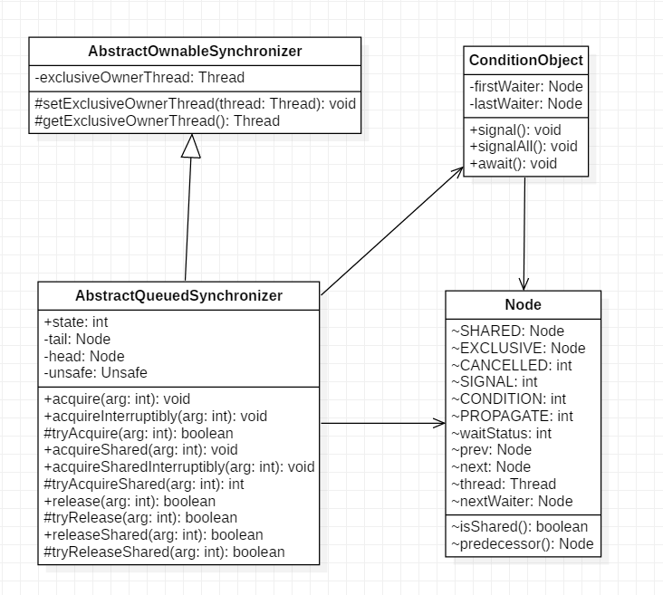
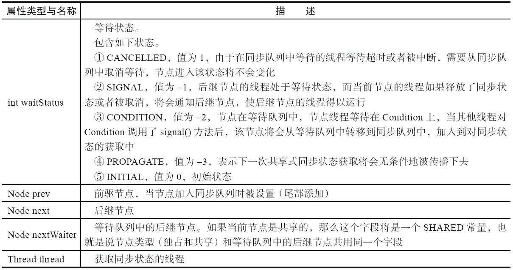
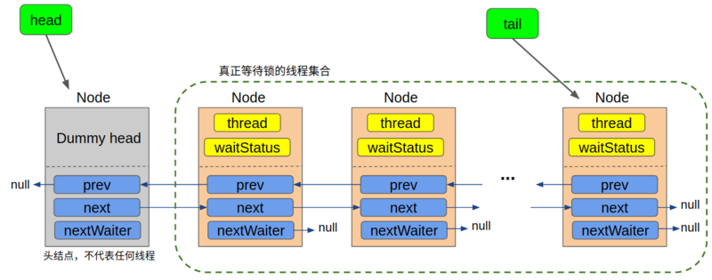
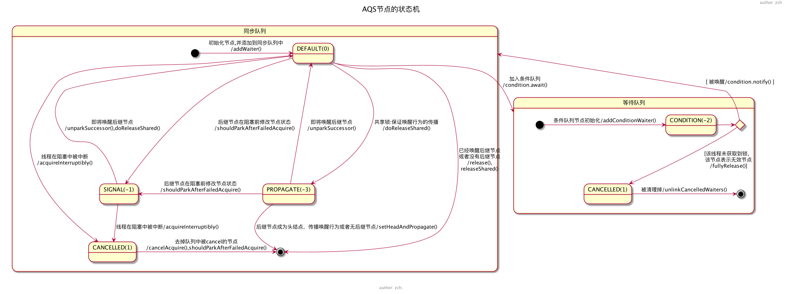

# 简介

AQS（AbstractQueuedSynchronizer）就是一个抽象的队列同步器，它是用来构建锁或者其他同步组件的基础框架，它维护了一个`volatile int state`来表示同步状态，通过内置的FIFO队列来完成线程等待排队。

AQS的设计是基于**模板方法**设计的，可供实现的模板方法基本上可以分为三类：独占式获取与释放同步状态、共享式获取与释放同步状态和查询同步队列中的等待线程情况。

子类通常被推荐定义为自定义同步组件的静态内部类，子类通过继承AQS并实现它的抽象模板方法来管理同步状态，而这些模板方法内部就是真正管理同步状态的地方（主要有tryAcquire、tryRelease、tryAcquireShared、tryReleaseShared等）。

# 概览

## uml



## 核心

### 状态

在AQS中，状态是由state属性来表示的，它是volatile类型的：

```
private volatile int state;
```

该属性的值即表示了锁的状态，state为0表示锁没有被占用，state大于0表示当前已经有线程持有该锁，这里之所以说大于0而不说等于1是因为可能存在可重入的情况。你可以把state变量当做是当前持有该锁的线程数量。

对于独占锁，同一时刻，锁只能被一个线程所持有。通过state变量是否为0，我们可以分辨当前锁是否被占用，但光知道锁是不是被占用是不够的，我们并不知道占用锁的线程是哪一个。在监视器锁中，我们用ObjectMonitor对象的_owner属性记录了当前拥有监视器锁的线程，而在AQS中，我们将通过exclusiveOwnerThread属性：

```
private transient Thread exclusiveOwnerThread; //继承自AbstractOwnableSynchronizer
```

`exclusiveOwnerThread`属性的值即为当前持有锁的线程，它就是我们在分析[监视器锁的原理](https://segmentfault.com/a/1190000016016459)的时候所说的“铁王座”。

### 队列

接着我们来看队列，AQS中，队列的实现是一个双向链表，被称为`sync queue`，它表示**所有等待锁的线程的集合**，有点类似于我们前面介绍synchronized原理的时候说的`wait set`。

我们前面说过，在并发编程中使用队列通常是**将当前线程包装成某种类型的数据结构扔到等待队列中**，我们先来看看队列中的每一个节点是怎么个结构：




注意，在这个Node类中有一个状态变量`waitStatus`，它表示了当前Node所代表的线程的等待锁的状态，在独占锁模式下，我们只需要关注`CANCELLED` `SIGNAL`两种状态即可。这里还有一个`nextWaiter`属性，它在独占锁模式下永远为`null`，仅仅起到一个标记作用，没有实际意义。

说完队列中的节点，我们接着说回这个`sync queue`，AQS是怎么使用这个队列的呢，既然是双向链表，操纵它自然只需要一个头结点和一个尾节点：

```java
// 头结点，不代表任何线程，是一个哑结点
private transient volatile Node head;

// 尾节点，每一个请求锁的线程会加到队尾
private transient volatile Node tail;
```

到这里，我们就了解到了这个`sync queue`的全貌：



这里有一点我们提前说一下，在AQS中的队列是一个CLH队列，它的head节点永远是一个哑结点（dummy node), 它不代表任何线程（某些情况下可以看做是代表了当前持有锁的线程），**因此head所指向的Node的thread属性永远是null**。只有从次头节点往后的所有节点才代表了所有等待锁的线程。也就是说，在当前线程没有抢到锁被包装成Node扔到队列中时，**即使队列是空的，它也会排在第二个**，我们会在它的前面新建一个dummy节点(具体的代码我们在后面分析源码时再详细讲)。为了便于描述，下文中我们把除去head节点的队列称作是等待队列，在这个队列中的节点才代表了所有等待锁的线程。

在继续往下之前我们再对着上图总结一下Node节点各个参数的含义：

- `thread`：表示当前Node所代表的线程
- `waitStatus`：表示节点所处的等待状态，共享锁模式下只需关注三种状态：`SIGNAL` `CANCELLED` `初始态(0)`
- `prev` `next`：节点的前驱和后继
- `nextWaiter`：进作为标记，值永远为null，表示当前处于独占锁模式

#### 节点状态机



#### 基于Node的的CLH阻塞队列是如何运作的

阻塞队列采用的是双向链表队列，头部节点默认获取资源获得执行权限。后续节点不断自旋方式查询前置节点是否执行完成，直到头部节点执行完成将自己的waitStatus状态修改以通知后续节点可以获取资源执行。CLH锁是一个有序的无饥饿的公平锁。// todo 表达有点问题，后续更改

首先确定自己是否为头部节点，如果是头部节点则直接获取资源开始执行，如果不是则自旋前置节点直到前置节点执行完成状态修改为CANCELLED,然后断开前置节点的链接，获取资源开始执行。// todo 表达有点问题，后续更改

- [并发之AQS原理(二) CLH队列与Node解析](https://www.cnblogs.com/yanlong300/p/10953185.html)
- [JAVA并发编程学习笔记之CLH队列锁](https://blog.csdn.net/aesop_wubo/article/details/7533186)

### CAS操作

前面我们提到过，CAS操作大对数是用来改变状态的，在AQS中也不例外。我们一般在静态代码块中初始化需要CAS操作的属性的偏移量：

```java
    private static final Unsafe unsafe = Unsafe.getUnsafe();
    private static final long stateOffset;
    private static final long headOffset;
    private static final long tailOffset;
    private static final long waitStatusOffset;
    private static final long nextOffset;

    static {
        try {
            stateOffset = unsafe.objectFieldOffset
                (AbstractQueuedSynchronizer.class.getDeclaredField("state"));
            headOffset = unsafe.objectFieldOffset
                (AbstractQueuedSynchronizer.class.getDeclaredField("head"));
            tailOffset = unsafe.objectFieldOffset
                (AbstractQueuedSynchronizer.class.getDeclaredField("tail"));
            waitStatusOffset = unsafe.objectFieldOffset
                (Node.class.getDeclaredField("waitStatus"));
            nextOffset = unsafe.objectFieldOffset
                (Node.class.getDeclaredField("next"));

        } catch (Exception ex) { throw new Error(ex); }
    }
```

从这个静态代码块中我们也可以看出，CAS操作主要针对5个属性，包括AQS的3个属性`state`,`head`和`tail`, 以及Node对象的两个属性`waitStatus`,`next`。说明这5个属性基本是会被多个线程同时访问的。

定义完属性的偏移量之后，接下来就是CAS操作本身了：

```java
protected final boolean compareAndSetState(int expect, int update) {
    return unsafe.compareAndSwapInt(this, stateOffset, expect, update);
}
private final boolean compareAndSetHead(Node update) {
    return unsafe.compareAndSwapObject(this, headOffset, null, update);
}
private final boolean compareAndSetTail(Node expect, Node update) {
    return unsafe.compareAndSwapObject(this, tailOffset, expect, update);
}
private static final boolean compareAndSetWaitStatus(Node node, int expect,int update) {
    return unsafe.compareAndSwapInt(node, waitStatusOffset, expect, update);
}
private static final boolean compareAndSetNext(Node node, Node expect, Node update) {
    return unsafe.compareAndSwapObject(node, nextOffset, expect, update);
}
```

如前面所说，最终CAS操作调用的还是Unsafe类的compareAndSwapXXX方法。

最后就是自旋了，这一点就没有什么好说的了，我们在后面源码分析的时候再详细讲。

# 参考

- [Java AQS 学习 并发编程的艺术](https://www.zybuluo.com/boothsun/note/843839)
- [逐行分析AQS源码(1)——独占锁的获取](https://segmentfault.com/a/1190000015739343)
- [AQS分析系列](https://www.javadoop.com/)
- [AQS系列](https://segmentfault.com/a/1190000016058789)

