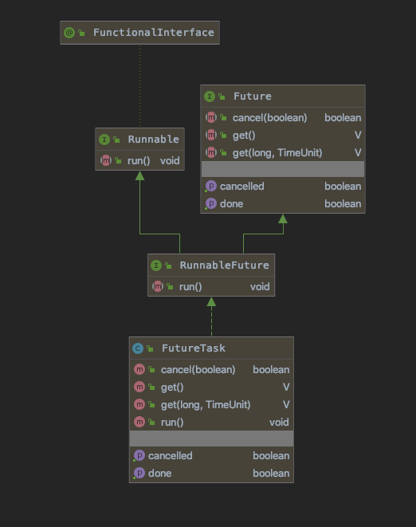
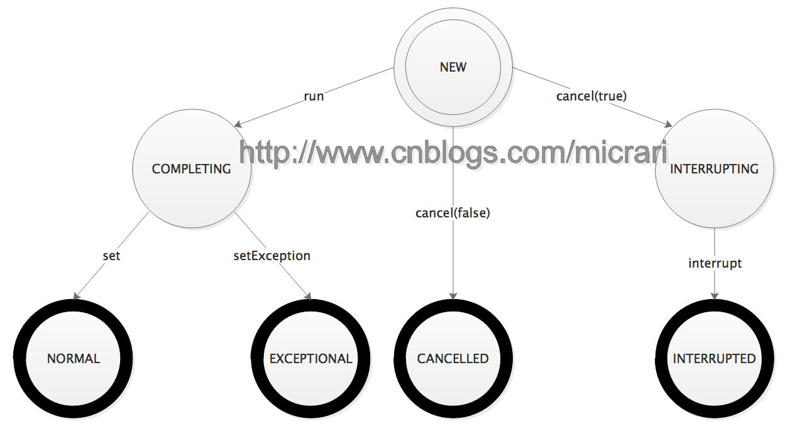

# 1. 背景与简介

Future是Java执行异步任务时的常用接口。我们通常会往`ExecutorService`中提交一个`Callable/Runnable`并得到一个Future对象，Future对象表示异步计算的结果，支持获取结果，取消计算等操作。在Java提供的Executor框架中，Future的默认实现为`java.util.concurrent.FutureTask`。本文针对`FutureTask`的源码进行分析与解读。



可以看到,FutureTask实现了RunnableFuture, 而RunnableFuture的JavaDoc对Runnable接口的run方法有了更精确的描述：run方法将该Future设置为计算的结果，除非计算被取消。

# 2. 源码解读

下面开始针对FutureTask的实现源码进行解读。

## 2.1 生命周期状态

FutureTask内置一个被volatile修饰的state变量。
按照生命周期的阶段可以分为：

- NEW 初始状态
- COMPLETING 任务已经执行完(正常或者异常)，准备赋值结果
- NORMAL 任务已经**正常**执行完，并已将任务返回值赋值到结果
- EXCEPTIONAL 任务执行失败，并将异常赋值到结果
- CANCELLED 取消
- INTERRUPTING 准备尝试中断执行任务的线程
- INTERRUPTED 对执行任务的线程进行中断(未必中断到)

这里先给出自制的状态流转图。

可以看到NEW为起始状态，而NORMAL, EXCEPTIONAL, CANCELLED, INTERRUPTED这些状态为终止状态，而COMPLETING和INTERRUPTING为中间暂时状态。

## 2.2 内部结构

1. `Callable callable``
   内部封装的Callable对象。如果通过构造函数传的是Runnable对象，FutureTask会通过调用`Executors#callable`，把Runnable对象封装成一个callable。
2. `Object outcome`
   用于保存计算结果或者异常信息。
3. `volatile Thread runner`
   用来运行callable的线程。
4. `volatile WaitNode waiters`
   FutureTask中用了[Trieber Stack](https://en.wikipedia.org/wiki/Treiber_Stack)来保存等待的线程。

## 2.3 run方法

```java
public void run() {
    /* 
     * state为NEW且对runner变量CAS成功。
     * 对state的判断写在前面，是一种优化。
     */
    if (state != NEW ||
            !UNSAFE.compareAndSwapObject(this, runnerOffset,
                null, Thread.currentThread()))
        return;
    try {
        Callable<V> c = callable;
        if (c != null && state == NEW) {
            V result;
            /*
             * 是否成功运行。
             * 之所以用了这样一个标志位，而不是把set方法写在try中call调用的后一句，
             * 是为了不想捕获set方法出现的异常。
             *
             * 举例来说，子类覆盖了FutureTask的done方法，
             * set -> finishCompletion -> done会抛出异常，
             * 然而实际上提交的任务是有正常的结果的。
             */
            boolean ran;
            try {
                result = c.call();
                ran = true;
            } catch (Throwable ex) {
                result = null;
                ran = false;
                setException(ex);
            }
            if (ran)
                set(result);
        }
    } finally {
        /* 
         * 
         * 要清楚，即便在runner被清为null后，仍然有可能有线程会进入到run方法的外层try块。
         * 举例：线程A和B都在执行第一行的if语句读到state == NEW,线程A成功cas了runner，并执行到此处。
         *       在此过程中线程B都没拿到CPU时间片。此时线程B一旦拿到时间片就能进到外层try块。
         *
         * 为了避免线程B重复执行任务，必须在set/setException方法被调用，才能把runner清为null。
         * 这时候其他线程即便进入到了外层try块，也一定能够读到state != NEW，从而避免任务重复执行。
         */
        runner = null;
        /*
         * 因为任务执行过程中由于cancel方法的调用，状态为INTERRUPTING,
         * 令当前线程等待INTERRUPTING状态变为INTERRUPTED。
         * 这是为了不想让中断操作逃逸出run方法以至于线程在执行后续操作时被中断。
         */
        int s = state;
        if (s >= INTERRUPTING)
            handlePossibleCancellationInterrupt(s);
    }
}

protected void set(V v) {
    // 通过CAS状态来确认计算没有被取消，结果也没有被设置过。
    if (UNSAFE.compareAndSwapInt(this, stateOffset, NEW, COMPLETING)) {
        outcome = v;
        UNSAFE.putOrderedInt(this, stateOffset, NORMAL); // final state
        finishCompletion();
    }
}

protected void setException(Throwable t) {
    // 通过CAS状态来确认计算没有被取消，结果也没有被设置过。
    if (UNSAFE.compareAndSwapInt(this, stateOffset, NEW, COMPLETING)) {
        outcome = t;
        UNSAFE.putOrderedInt(this, stateOffset, EXCEPTIONAL); // final state
        finishCompletion();
    }
}

private void finishCompletion() {
    for (WaitNode q; (q = waiters) != null;) {
        // 必须将栈顶CAS为null，否则重读栈顶并重试。
        if (UNSAFE.compareAndSwapObject(this, waitersOffset, q, null)) {
            // 遍历并唤醒栈中节点对应的线程。
            for (;;) {
                Thread t = q.thread;
                if (t != null) {
                    q.thread = null;
                    LockSupport.unpark(t);
                }
                WaitNode next = q.next;
                if (next == null)
                    break;
                // 将next域置为null，这样对GC友好。
                q.next = null; 
                q = next;
            }
            break;
        }
    }

    /*
     * done方法是暴露给子类的一个钩子方法。
     *
     * 这个方法在ExecutorCompletionService.QueueingFuture中的override实现是把结果加到阻塞队列里。
     * CompletionService谁用谁知道，奥秘全在这。
     */
    done();

    /* 
     * callable置为null主要为了减少内存开销,
     * 更多可以了解JVM memory footprint相关资料。
     */
    callable = null;
}

private void handlePossibleCancellationInterrupt(int s) {
    /*
     * 这里的主要目的就是等调用cancel方法的线程完成中断。
     *
     * 以防止中断操作逃逸出run或者runAndReset方法,影响后续操作。
     *
     * 实际上，当前调用cancel方法的线程不一定能够中断到本线程。
     * 有可能cancel方法里读到runner是null，甚至有可能是其它并发调用run/runAndReset方法的线程。
     * 但是也没办法判断另一个线程在cancel方法中读到的runner到底是什么，所以索性自旋让出CPU时间片也没事。
     */
    if (s == INTERRUPTING)
        while (state == INTERRUPTING)
            Thread.yield();

    /*
     * 下面的代码在JDK8中已经被注释掉了。
     * 因为在原来的设计中，是想把cancel方法设置的中断位给清除的。
     * 但是实际上也应该允许调用FutureTask的线程使用中断作为线程间通信的机制，
     * 这里没办法区分中断位到底是不是来自cancel方法的调用。
     */

    // assert state == INTERRUPTED;

    // We want to clear any interrupt we may have received from
    // cancel(true).  However, it is permissible to use interrupts
    // as an independent mechanism for a task to communicate with
    // its caller, and there is no way to clear only the
    // cancellation interrupt.
    //
    // Thread.interrupted();
}
```

## 2.4 get方法

```java
public V get() throws InterruptedException, ExecutionException {
    int s = state;
    // NEW或者COMPLETING。
    if (s <= COMPLETING)
        s = awaitDone(false, 0L);
    return report(s);
}

private int awaitDone(boolean timed, long nanos) throws InterruptedException {
    final long deadline = timed ? System.nanoTime() + nanos : 0L;
    WaitNode q = null;
    boolean queued = false;
    for (;;) {
        if (Thread.interrupted()) {
            removeWaiter(q);
            throw new InterruptedException();
        }

        int s = state;
        // 完成赋值
        if (s > COMPLETING) {
            // 如果q已经被初始化了，为了GC需要清q.thread。
            if (q != null)
                q.thread = null;
            return s;
        }
        // COMPLETING是一个很短暂的状态，调用Thread.yield期望让出时间片，之后重试循环。
        else if (s == COMPLETING)
            Thread.yield();
        // 初始化节点，重试一次循环。
        else if (q == null)
            q = new WaitNode();
        // queued记录是否已经入栈,此处准备将节点压栈。
        else if (!queued)
            /*
             *  这是Treiber Stack算法入栈的逻辑。
             *  Treiber Stack是一个基于CAS的无锁并发栈实现,
             *  更多可以参考https://en.wikipedia.org/wiki/Treiber_Stack
             */
            queued = UNSAFE.compareAndSwapObject(this, waitersOffset,
                    q.next = waiters, q);
        // 如果有时限，判断是否超时，未超时则park剩下的时间。
        else if (timed) {
            nanos = deadline - System.nanoTime();
            // 超时，移除栈中节点。
            if (nanos <= 0L) {
                removeWaiter(q);
                return state;
            }
            LockSupport.parkNanos(this, nanos);
        }
        else
            LockSupport.park(this);
    }
}

/**
 * 清理用于保存等待线程栈里的节点。
 * 所谓节点无效就是内部的thread为null，
 * 一般有以下几种情况:
 * 1. 节点调用get超时。
 * 2. 节点调用get中断。
 * 3. 节点调用get拿到task的状态值(> COMPLETING)。
 *
 * 此方法干了两件事情：
 * 1. 置标记参数node的thread为null。
 * 2. 清理栈中的无效节点。
 *
 * 如果在遍历过程中发现有竞争则重新遍历栈。
 */
private void removeWaiter(WaitNode node) {
    if (node != null) {
        node.thread = null;
        retry:
        for (;;) {          // restart on removeWaiter race
            for (WaitNode pred = null, q = waiters, s; q != null; q = s) {
                s = q.next;
                // 如果当前节点仍有效,则置pred为当前节点，继续遍历。
                if (q.thread != null)
                    pred = q;
                /*
                 * 当前节点已无效且有前驱，则将前驱的后继置为当前节点的后继实现删除节点。
                 * 如果前驱节点已无效，则重新遍历waiters栈。
                 */
                else if (pred != null) {
                    pred.next = s;
                    if (pred.thread == null)
                        continue retry;
                }
                /*
                 * 当前节点已无效，且当前节点没有前驱，则将栈顶置为当前节点的后继。
                 * 失败的话重新遍历waiters栈。
                 */
                else if (!UNSAFE.compareAndSwapObject(this, waitersOffset,
                            q, s))
                    continue retry;
            }
            break;
        }
    }
}

/**
 * 导出结果。
 */
private V report(int s) throws ExecutionException {
    Object x = outcome;
    // 正常执行完计算任务。
    if (s == NORMAL)
        return (V)x;
    // 取消。
    if (s >= CANCELLED)
        throw new CancellationException();
    // 执行计算任务时发生异常。
    throw new ExecutionException((Throwable)x);
}
```

- [Java FutureTask 是如何保证返回结果的可见性的？](https://stackoverflow.com/questions/14432400/why-outcome-object-in-futuretask-is-non-volatile?r=SearchResults)

## 2.5 cancel方法

```java
public boolean cancel(boolean mayInterruptIfRunning) {
    /*
     * 在状态还为NEW的时候，根据参数中的是否允许传递，
     * 将状态流转到INTERRUPTING或者CANCELLED。
     */
    if (!(state == NEW &&
                UNSAFE.compareAndSwapInt(this, stateOffset, NEW,
                    mayInterruptIfRunning ? INTERRUPTING : CANCELLED)))
        return false;
    try {
        if (mayInterruptIfRunning) {
            try {
                // 中断runner线程。
                Thread t = runner;
                if (t != null)
                    t.interrupt();
            } finally {
                UNSAFE.putOrderedInt(this, stateOffset, INTERRUPTED);
            }
        }
    } finally {
        // 该方法上文已经分析过。
        finishCompletion();
    }
    return true;
}
```

# 3. FutureTask存在的问题

至此已经将FutureTask的源码解读分析完毕，在读过源码之后，我个人认为JDK8u111的FutureTask源码存在两个问题，目前还需要进一步确认。

## 3.1 cancel(true)调用interrupt的线程对象

FutureTask的run方法的进入条件是

```
state == NEW && UNSAFE.compareAndSwapObject(this, runnerOffset, null, Thread.currentThread()))
```

假设有两个线程A和B调用run方法，线程C调用cancel方法。
时刻1: 线程A和B同时读到state == NEW。
时刻2: 线程A成功对runner变量CAS进入run方法主体。
时刻3: 线程C调用cancel方法，成功将状态CAS为CANCELLED。
时刻4: 线程A调用finally中的runner = null。
时刻5: 线程B开始执行run方法第一句if的后半句，成功将runner变量CAS到线程B。
时刻6: 线程C读到runner为线程B，准备对线程B进行interrupt()
时刻7: 线程A调用handlePossibleCancellationInterrupt等待状态从INTERRUPTING流转至INTERRUPTED。
时刻8: 线程B被中断。

这里的问题是，调用cancel方法的线程C中断的是实质上没有对callable进行call调用的线程B，而线程A还试图防止中断操作逃逸出run方法。
这个东西在Future的JavaDoc上说了很含糊，如下所示:

```java
* @param mayInterruptIfRunning {@code true} if the thread executing this
     * task should be interrupted; otherwise, in-progress tasks are allowed
     * to complete
```

上面的情况到底线程A和B哪个算是`the thread executing this task`说不清。

## 3.2 内存占用问题

通过阅读源码，发现FutureTask还是存在一个隐形的内存占用问题的，或者按照《Effective Java》上说的应该叫**无意识的对象保留**。
这个问题就是在FutureTask计算完成后，可能内部用于保存等待线程的栈留有一些已经无用的等待节点。

时刻1: 某线程调用get，已经入等待栈，此时waiters为该线程对应节点。
时刻2: 有大量线程通过调用get试图获取计算结果，get -> awaitDone方法中，经过两轮循环都读到状态是NEW的话，此时它们节点已经被初始化过了，但还没开始入队。
时刻3: 有线程调用run方法，通过run -> set -> finishCompletion，将waiters置为null，并唤醒了已经入栈的那个线程。
时刻4: 调用awaitDone方法的那些线程再试图入队的话，后面循环会发现状态已经是NORMAL了，但是waiters栈此时不为空，而且再也没法被清掉了。

这样下来，该FutureTask内部可能会留有一些的无效节点。具体会留多少实际上取决于那个瞬间有多少线程准备执行以及多少能够成功CAS。

```java
 queued = UNSAFE.compareAndSwapObject(this, waitersOffset, q.next = waiters, q);
```

# 参考

- 原文:[FutureTask源码解读](https://www.cnblogs.com/micrari/p/7374513.html)