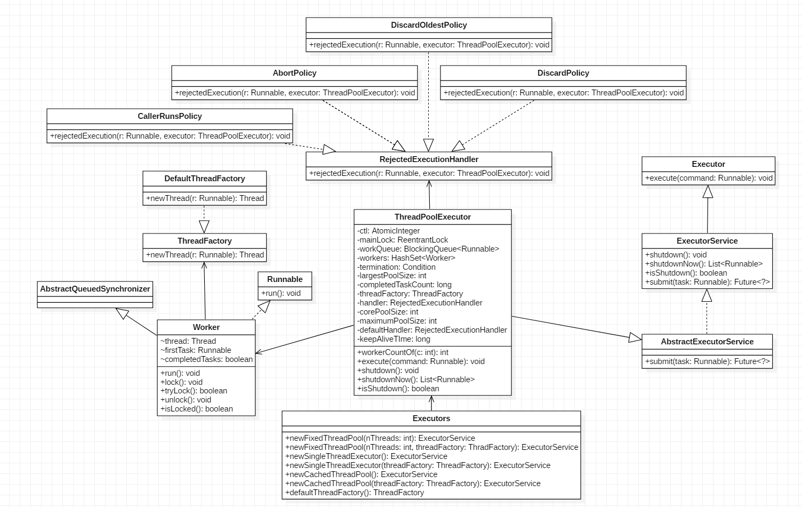
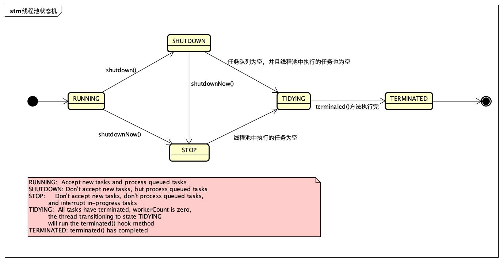
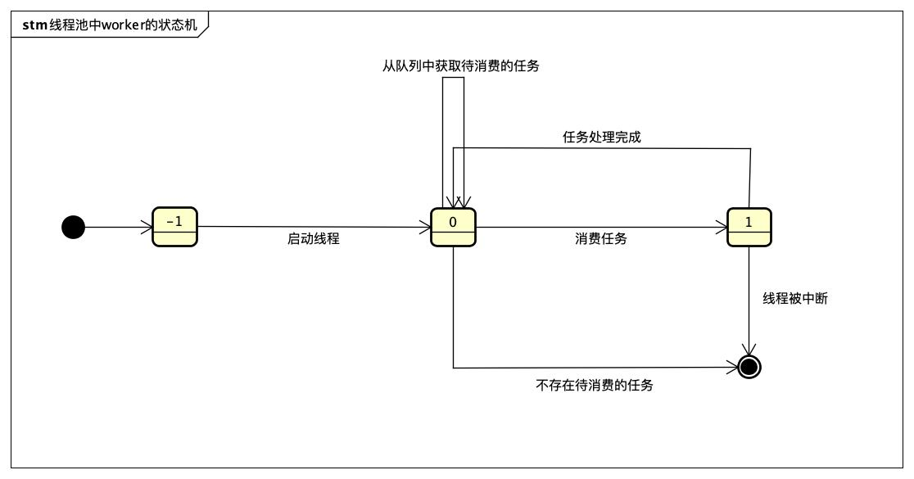

# 线程池的实现原理

## 类图



`ThreadPoolExecutor`: `mainLock`是独占锁，用来控制新增`Worker`线程操作的原子性。`termination`是该锁对应的条件队列。

`Worker`继承`AQS`并实现了Runnable接口，是具体承载任务的而对象。`Worker`继承了`AQS`，自己实现了简单不可重入独占锁，其中`state=0`表示锁未被获取，`state=1`表示锁已经被获取，`state=-1`是常见Worker的默认状态，是为了避免该线程在运行`runWorker`方法前被中断。

## 状态



ThreadPoolExecutor中的`ctl`是一个原子变量，用来记录线程池状态和线程池中的线程个数，类似于ReentrantReadWriteLock中使用一个变量来保存两种信息。

以下为与`ctl`相关的变量与函数：

```java
private final AtomicInteger ctl = new AtomicInteger(ctlOf(RUNNING, 0));
// 假设Integer为32位（不同平台下可能不同），则前3位用来表示线程运行状态，
// 后29位用来表示线程个数
private static final int COUNT_BITS = Integer.SIZE - 3;
// 00011111111111111111111111111111
private static final int CAPACITY   = (1 << COUNT_BITS) - 1;

// 11100000000000000000000000000000
private static final int RUNNING    = -1 << COUNT_BITS;
// 00000000000000000000000000000000
private static final int SHUTDOWN   =  0 << COUNT_BITS;
// 00100000000000000000000000000000
private static final int STOP       =  1 << COUNT_BITS;
// 01000000000000000000000000000000
private static final int TIDYING    =  2 << COUNT_BITS;
// 01100000000000000000000000000000
private static final int TERMINATED =  3 << COUNT_BITS;

// 取高3位的值
private static int runStateOf(int c)     { return c & ~CAPACITY; }
// 低29位的值
private static int workerCountOf(int c)  { return c & CAPACITY; }
// 通过指定的rs（Running State）和wc（Workers Count）生成新的ctl状态值
private static int ctlOf(int rs, int wc) { return rs | wc; }
```

线程池的状态含义如下：

- RUNNING：接受新任务并处理阻塞队列里的任务。
- SHUTDOWN：拒绝新任务但是处理阻塞队列里面的任务。
- STOP：拒绝新任务并且抛弃阻塞队列里的任务，同时会中断正在处理的任务。
- TIDYING：所有任务都执行完后当前线程池活动线程数为0，将要调用terminated方法（相当于一个过渡状态）。
- TERMINATED： 终止状态，terminated方法调用完成后的状态。

## 源码分析

### 线程池执行任务 - execute

ThreadPoolExecutor的实现实际是一个生产-消费模型，当用户添加任务到线程池时相当于生产者生产元素，workers中的线程直接执行任务或者从任务队列里面获取任务（当没有空闲的Worker时，任务会被暂存于任务队列中）时相当于消费者消费元素。

```java
// 执行任务
public void execute(Runnable command) {
    if (command == null)
        throw new NullPointerException();
    // 获取线程池状态
    int c = ctl.get();
    // 1. 如果Worker个数小于核心线程数则新增一个Worker
    if (workerCountOf(c) < corePoolSize) {
        if (addWorker(command, true))
            return;
        c = ctl.get();
    }
    // 2. 如果线程池还在运行，尝试将任务加入工作队列
    if (isRunning(c) && workQueue.offer(command)) {
        int recheck = ctl.get();
        // 可能任务入队后线程池又关闭了，则直接移除该任务
        //这儿为什么需要recheck，是因为任务入队列前后，线程池的状态可能会发生变化。
        if (! isRunning(recheck) && remove(command))
            reject(command);
        // 2.1 任务入队列后，可能所有Worker都因为keepAliveTime到达而被回收，
        //     这时需要重新创建一个Worker来处理任务队列里面的任务    
        else if (workerCountOf(recheck) == 0)
            addWorker(null, false);
    }
    // 3. 如果任务队列满了，则尝试增加一个非核心线程来处理任务,失败则执行拒绝策略
    else if (!addWorker(command, false))
        reject(command);
}

// 添加一个Worker线程
private boolean addWorker(Runnable firstTask, boolean core) {

    // 1. Worker个数 + 1
    retry:
    for (;;) {
        int c = ctl.get();
        int rs = runStateOf(c);

      	// 1.1 判断当前线程池状态是否可以新增线程
        // 这个条件写得比较难懂，我对其进行了调整，和下面的条件等价
        // (rs > SHUTDOWN) || 
        // (rs == SHUTDOWN && firstTask != null) || 
        // (rs == SHUTDOWN && workQueue.isEmpty())
        // a. 线程池状态大于SHUTDOWN时，直接返回false
        // b. 线程池状态等于SHUTDOWN，且firstTask不为null，直接返回false
        // c. 线程池状态等于SHUTDOWN，且firstTask为null,且队列为空，直接返回false
        if (rs >= SHUTDOWN &&
            ! (rs == SHUTDOWN &&
                firstTask == null &&
                ! workQueue.isEmpty()))
            return false;

      	// 1.2 通过循环+CAS，worker的数量+1
        for (;;) {
            int wc = workerCountOf(c);
            // Worker数量检测
            if (wc >= CAPACITY ||
                wc >= (core ? corePoolSize : maximumPoolSize))
                return false;
            // 成功增加了Worker个数，直接跳出外层for循环执行实际添加Worker的代码    
            if (compareAndIncrementWorkerCount(c))
                break retry;
            c = ctl.get();
            // 状态改变则跳出内层循环，再次执行外循环进行新的状态判断
            // 否则继续在内层循环自旋直到CAS操作成功
            if (runStateOf(c) != rs)
                continue retry;
        }
    }

    // 执行到此处说明已通过CAS操作成功增减了Worker个数
    // 2. 实际增加Worker。把worker线程加入workers集合中，启动woker线程
    boolean workerStarted = false;
    boolean workerAdded = false;
    Worker w = null;
    try {
        w = new Worker(firstTask);
        final Thread t = w.thread;
        if (t != null) {
            final ReentrantLock mainLock = this.mainLock;
            // 加独占锁是为了实现workers同步，因为可能多个线程调用了线程池的execute方法
            mainLock.lock();
            try {
                // 重新获取线程池状态，因为有可能在获取锁之前执行了shutdown操作
                int rs = runStateOf(ctl.get());
                if (rs < SHUTDOWN ||
                    (rs == SHUTDOWN && firstTask == null)) {
                    if (t.isAlive())
                        throw new IllegalThreadStateException();
                    // 将新创建的Worker添加到workers队列     
                    workers.add(w);
                    int s = workers.size();
                    // 更新线程池工作线程最大数量
                    if (s > largestPoolSize)
                        largestPoolSize = s;
                    workerAdded = true;
                }
            } finally {
                mainLock.unlock();
            }
            if (workerAdded) {
                // 添加成功则启动工作线程
                t.start();
                workerStarted = true;
            }
        }
    } finally {
        if (! workerStarted)
            // worker线程启动失败，说明线程池状态发生了变化（关闭操作被执行），需要进行shutdown相关操作
            addWorkerFailed(w);
    }
    return workerStarted;
}
```

### 核心线程执行逻辑 - Worker

任务提交到线程池后由Worker来执行。

```java
Worker(Runnable firstTask) {
    // 调用runWorker前禁止中断
    setState(-1);
    this.firstTask = firstTask;
    this.thread = getThreadFactory().newThread(this);
}

final void runWorker(Worker w) {
    Thread wt = Thread.currentThread();
    Runnable task = w.firstTask;
    w.firstTask = null;
    w.unlock(); // 将state置为0，允许中断
    boolean completedAbruptly = true;
    try {
        // 1. 执行传入的任务或任务队列中的任务
        // 		getTask用于从任务队列中获取任务，可能会被阻塞
        while (task != null || (task = getTask()) != null) {
          // 执行任务是串行的 
          w.lock();
            ...
            try {
                // 空方法，用于子类继承重写
                beforeExecute(wt, task);
                Throwable thrown = null;
                try {
                    // 2. 执行任务
                    task.run();
                } catch (RuntimeException x) {
                    thrown = x; throw x;
                } catch (Error x) {
                    thrown = x; throw x;
                } catch (Throwable x) {
                    thrown = x; throw new Error(x);
                } finally {
                    // 空方法，用于子类继承重写
                    afterExecute(task, thrown);
                }
            } finally {
                task = null;
                // 添加任务完成数量
                w.completedTasks++;
                w.unlock();
            }
        }
        completedAbruptly = false;
    } finally {
        // 3. Worker被回收前执行清理工作
        processWorkerExit(w, completedAbruptly);
    }
}
```

- 在构造函数中设置Worker的状态为`-1`是为了避免当前Worker在调用runWorker方法前被中断（当其他线程调用了shutdownNow方法，如果Worker状态>=0则会中断该线程）。
- runWorker中调用unlock方法时将state置为0，使Worker线程可被中断。
- `Worker`线程`state`的状态机
	 

processWorkerExit方法如下:

```java
private void processWorkerExit(Worker w, boolean completedAbruptly) {
    // 如果runWorker方法非正常退出，则将workerCount递减
    // 如果runWorker方法正常退出，在getTask()方法中,workerCount递减
    if (completedAbruptly)
        decrementWorkerCount();
		
  	// 通过全局锁的方式移除worker
    final ReentrantLock mainLock = this.mainLock;
    mainLock.lock();
    try {
        completedTaskCount += w.completedTasks;
        workers.remove(w);
    } finally {
        mainLock.unlock();
    }

    // 尝试设置线程池状态为TERMINATED。
    // 如果当前是SHUTDOWN状态并且任务队列为空或当前是STOP状态，当前线程池里没有活动线程
    tryTerminate();

    int c = ctl.get();
    if (runStateLessThan(c, STOP)) {
      // 如果消费线程是异常退出，那么新增一个消费线程；
      // 如果消费线程是正常退出，那么当前线程数小于线程池允许的最小线程数，也新增一个消费线程  
      if (!completedAbruptly) {
          	// 计算线程池允许的最小的线程数
            int min = allowCoreThreadTimeOut ? 0 : corePoolSize;
            if (min == 0 && ! workQueue.isEmpty())
                min = 1;
            if (workerCountOf(c) >= min)
                return; // 将不执行addWorker操作
        }
        addWorker(null, false);
    }
}
```

### 优雅型退出 -  shutdown

调用shutdown后，线程池将不再接受新任务，但任务队列中的任务还是要执行的。

```java
public void shutdown() {
    final ReentrantLock mainLock = this.mainLock;
    mainLock.lock();
    try {
        // 检查是否有关闭线程池的权限
        checkShutdownAccess();
        // 设置当前线程池状态为SHUTDOWN，如果已经是SHUTDOWN则直接返回
        advanceRunState(SHUTDOWN);
        // 中断空闲的Worker
        interruptIdleWorkers();
        onShutdown(); // hook for ScheduledThreadPoolExecutor
    } finally {
        mainLock.unlock();
    }
    // 尝试将状态转为TERMINATED
    tryTerminate();
}

private static final RuntimePermission shutdownPerm = new RuntimePermission("modifyThread");

/**
 * 检查是否设置了安全管理器，是则看当前调用shutdown命令的线程是否具有关闭线程的权限，
 * 如果有还要看调用线程是否有中断工作线程的权限，
 * 如果没有权限则抛出异常
 */
private void checkShutdownAccess() {
    SecurityManager security = System.getSecurityManager();
    if (security != null) {
        security.checkPermission(shutdownPerm);
        final ReentrantLock mainLock = this.mainLock;
        mainLock.lock();
        try {
            for (Worker w : workers)
                security.checkAccess(w.thread);
        } finally {
            mainLock.unlock();
        }
    }
}

// 变更线程池的状态
private void advanceRunState(int targetState) {
    for (;;) {
        int c = ctl.get();
        if (runStateAtLeast(c, targetState) ||
            ctl.compareAndSet(c, ctlOf(targetState, workerCountOf(c))))
            break;
    }
}

// 设置所有空闲线程的中断标志
private void interruptIdleWorkers() {
    interruptIdleWorkers(false);
}

private void interruptIdleWorkers(boolean onlyOne) {
    final ReentrantLock mainLock = this.mainLock;
    mainLock.lock();
    try {
        for (Worker w : workers) {
            Thread t = w.thread;
            // 线程没有被中断，并且线程加锁成功
            // 加锁成功说明线程在执行runWorker方法调用getTask时被阻塞
            if (!t.isInterrupted() && w.tryLock()) {
                try {
                    t.interrupt();
                } catch (SecurityException ignore) {
                } finally {
                    w.unlock();
                }
            }
            // 如果只中断一个则退出循环
            if (onlyOne)
                break;
        }
    } finally {
        mainLock.unlock();
    }
}

final void tryTerminate() {
    for (;;) {
        int c = ctl.get();
        // 1. 判断是否满足可终止条件
        // 线程池处于RUNNING状态
        // 或处于TIDYING状态（说明有其他线程调用了tryTerminate方法且即将成功终止线程池）
        // 或线程池正处于SHUTDOWN状态且任务队列不为空时不可终止
        if (isRunning(c) ||
            runStateAtLeast(c, TIDYING) ||
            (runStateOf(c) == SHUTDOWN && ! workQueue.isEmpty()))
            return;
        // 2. 还有Worker的话，中断一个空闲Worker后返回   
        // 正在执行任务的Worker会在执行完任务后调用tryTerminate方法 
        if (workerCountOf(c) != 0) { 
            interruptIdleWorkers(ONLY_ONE);
            return;
        }

       // 3. 线程池状态陆续设置成TIDYING，TERMINATED
        final ReentrantLock mainLock = this.mainLock;
        mainLock.lock();
        try {
            // 设置线程池状态为TIDYING
            if (ctl.compareAndSet(c, ctlOf(TIDYING, 0))) {
                try {
                    // 空方法，由子类继承重写，进行线程池关闭时的清理工作
                    terminated();
                } finally {
                    // 此处无需使用CAS，因为即使CAS失败也说明线程池终止了
                    ctl.set(ctlOf(TERMINATED, 0));
                    // 激活因调用条件变量termination的await系列方法而被阻塞的所有线程
                    termination.signalAll();
                }
                return;
            }
        } finally {
            mainLock.unlock();
        }
        // else retry on failed CAS
    }
}
```

### 强制退出 - shutdownNow

调用shutdownNow后，线程池将不会再接受新任务，并且会丢弃任务队列里面的任务且中断正在执行的任务，然后立刻返回任务队列里面的任务列表。

```java
public List<Runnable> shutdownNow() {
    List<Runnable> tasks;
    final ReentrantLock mainLock = this.mainLock;
    mainLock.lock();
    try {
        checkShutdownAccess();
        advanceRunState(STOP);
        // 不是interruptIdleWorkers()
        // 中断所有在运行的Worker
        interruptWorkers();
        // 将任务队列中的任务移动到tasks中
        tasks = drainQueue();
    } finally {
        mainLock.unlock();
    }
    tryTerminate();
    return tasks;
}

// 中断所有在运行的Worker
private void interruptWorkers() {
    final ReentrantLock mainLock = this.mainLock;
    mainLock.lock();
    try {
        for (Worker w : workers)
            w.interruptIfStarted();
    } finally {
        mainLock.unlock();
    }
}
```

### 等待线程池结束-awaitTermination

当线程调用awaitTermination后，当前线程会被阻塞，直到线程池状态变成TERMINATIED或等待超时才返回。

```java
public boolean awaitTermination(long timeout, TimeUnit unit)
    throws InterruptedException {
    long nanos = unit.toNanos(timeout);
    final ReentrantLock mainLock = this.mainLock;
    mainLock.lock();
    try {
        for (;;) {
            // 如果线程池已经终止，则直接返回
            if (runStateAtLeast(ctl.get(), TERMINATED))
                return true;
            if (nanos <= 0)
                return false;
            // 等待相应时间，线程池成功关闭后会调用termination.signalAll()将当前线程激活
            nanos = termination.awaitNanos(nanos);
        }
    } finally {
        mainLock.unlock();
    }
}
```

# 参考

- [interrupt、interrupted和isInterrupted的区别](https://www.cnblogs.com/lujiango/p/7641983.html)
- [Java并发包中线程池ThreadPoolExecutor原理探究](https://github.com/afkbrb/java-concurrency-note/blob/master/08Java%E5%B9%B6%E5%8F%91%E5%8C%85%E4%B8%AD%E7%BA%BF%E7%A8%8B%E6%B1%A0ThreadPoolExecutor%E5%8E%9F%E7%90%86%E6%8E%A2%E7%A9%B6.md)