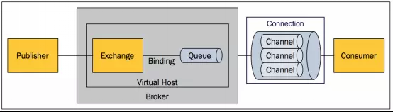

#  消息队列的历史 
了解一件事情的来龙去脉，将不会对它感到神秘。让我们来看看消息队列（Message Queue）这项技术的发展历史。
Message Queue的需求由来已久，80年代最早在金融交易中，高盛等公司采用Teknekron公司的产品，当时的Message queuing软件叫做：the information bus（TIB）。 TIB被电信和通讯公司采用，路透社收购了Teknekron公司。之后，IBM开发了MQSeries，微软开发了Microsoft Message Queue（MSMQ）。这些商业MQ供应商的问题是厂商锁定，价格高昂。2001年，Java Message queuing试图解决锁定和交互性的问题，但对应用来说反而更加麻烦了。

于是2004年，摩根大通和iMatrix开始着手Advanced Message Queuing Protocol （AMQP）开放标准的开发。2006年，AMQP规范发布。2007年，Rabbit技术公司基于AMQP标准开发的RabbitMQ 1.0 发布。

# AMQP messaging 中的基本概念 

- 总的AMQP的结构图

  

- Broker: 接收和分发消息的应用，RabbitMQ Server就是Message Broker。
- Virtual host: 出于多租户和安全因素设计的，把AMQP的基本组件划分到一个虚拟的分组中，类似于网络中的namespace概念。当多个不同的用户使用同一个RabbitMQ server提供的服务时，可以划分出多个vhost，每个用户在自己的vhost创建exchange／queue等。
- Connection: 连接，一个网络连接，比如TCP/IP套接字连接。Channel是建立在Connection之上的，一个Connection可以建立多个Channel
- Channel: 如果每一次访问RabbitMQ都建立一个Connection，在消息量大的时候建立TCP Connection的开销将是巨大的，效率也较低。Channel是在connection内部建立的逻辑连接，如果应用程序支持多线程，通常每个thread创建单独的channel进行通讯，AMQP method包含了channel id帮助客户端和message broker识别channel，所以channel之间是完全隔离的。Channel作为轻量级的Connection极大减少了操作系统建立TCP connection的开销。
- Exchange: message到达broker的第一站，根据分发规则，匹配查询表中的routing key，分发消息到queue中去。常用的类型有：direct (point-to-point), topic (publish-subscribe) and fanout (multicast)。
- Queue: 消息队列载体，每个消息都会被投入到一个或多个队列。
- Binding: exchange和queue之间的虚拟连接，binding中可以包含routing key。Binding信息被保存到exchange中的查询表中，用于message的分发依据。

# 基本属性
## exchange
- exchange: 交换器名称
- type : 交换器类型 DIRECT("direct"), FANOUT("fanout"), TOPIC("topic"), HEADERS("headers");
- durable: 是否持久化,durable设置为true表示持久化,反之是非持久化,持久化的可以将交换器存盘,在服务器重启的时候不会丢失信息.
- autoDelete 是否自动删除,设置为TRUE则表是自动删除,自删除的前提是至少有一个队列或者交换器与这交换器绑定,之后所有与这个交换器绑定的队列或者交换器都与此解绑,一般都设置为fase
- internal 是否内置,如果设置 为true,则表示是内置的交换器,客户端程序无法直接发送消息到这个交换器中,只能通过交换器路由到交换器的方式
- arguments: 扩展参数，用于扩展AMQP协议自制定化使用

## queue
![enter description here][1]

## binding
![enter description here][2]

# 消费端的确认

![enter description here][3]
![enter description here][4]

# 消息的何去何从

- mandatory
![enter description here][5]

- immediate

![enter description here][6]

# TTL

![enter description here][7]

# 死信队列

![enter description here][8]
通过x-dead-letter-exchange指定死信队列的名称

![enter description here][9]

# 延迟队列

![enter description here][10]

![enter description here][11]

延迟队列就是TTL+DLX

# 优先级队列

![enter description here][12]

![enter description here][13]

# 持久化

![enter description here][14]

![enter description here][15]

- 持久化能保证数据一定不会丢失吗？不能

![enter description here][16]

![enter description here][17]

# 生产者确认机制

- 事务机制

![enter description here][18]

![enter description here][19]

![enter description here][20]

![enter description here][21]

- 发送方确认机制

![enter description here][22]

![enter description here][23]

![enter description here][24]

# 消息传输的保障

![enter description here][25]

![enter description here][26]

# vhost

![enter description here][27]

  [1]: ./images/1542064466280.jpg "1542064466280.jpg"
  [2]: ./images/1542064559337.jpg "1542064559337.jpg"
  [3]: ./images/1542065357112.jpg "1542065357112.jpg"
  [4]: ./images/1542065392453.jpg "1542065392453.jpg"
  [5]: ./images/1542065617851.jpg "1542065617851.jpg"
  [6]: ./images/1542065778781.jpg "1542065778781.jpg"
  [7]: ./images/1542066072497.jpg "1542066072497.jpg"
  [8]: ./images/1542066252503.jpg "1542066252503.jpg"
  [9]: ./images/1542066862402.jpg "1542066862402.jpg"
  [10]: ./images/1542066574356.jpg "1542066574356.jpg"
  [11]: ./images/1542066886255.jpg "1542066886255.jpg"
  [12]: ./images/1542067143647.jpg "1542067143647.jpg"
  [13]: ./images/1542067169076.jpg "1542067169076.jpg"
  [14]: ./images/1542073457456.jpg "1542073457456.jpg"
  [15]: ./images/1542073608161.jpg "1542073608161.jpg"
  [16]: ./images/1542074264155.jpg "1542074264155.jpg"
  [17]: ./images/1542074290359.jpg "1542074290359.jpg"
  [18]: ./images/1542074547034.jpg "1542074547034.jpg"
  [19]: ./images/1542074600736.jpg "1542074600736.jpg"
  [20]: ./images/1542074636271.jpg "1542074636271.jpg"
  [21]: ./images/1542074668358.jpg "1542074668358.jpg"
  [22]: ./images/1542075076545.jpg "1542075076545.jpg"
  [23]: ./images/1542075223975.jpg "1542075223975.jpg"
  [24]: ./images/1542075251585.jpg "1542075251585.jpg"
  [25]: ./images/1542075450690.jpg "1542075450690.jpg"
  [26]: ./images/1542075477299.jpg "1542075477299.jpg"
  [27]: ./images/1542089683386.jpg "1542089683386.jpg"