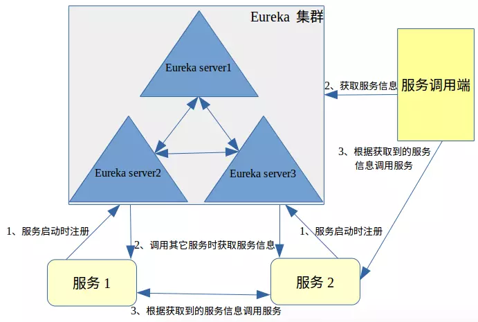
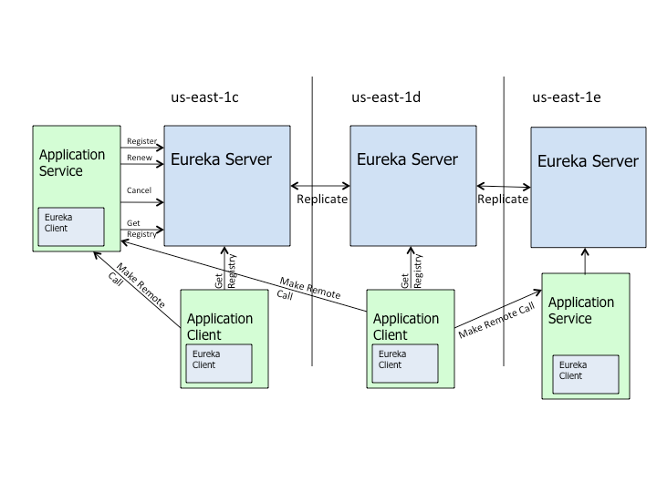

# eureka如何管理服务调用

eureka如何管理服务调用的？我们先来看个图：

- 在Eureka Client启动的时候，将自身的服务的信息发送到Eureka Server。然后进行2调用当前服务器节点中的其他服务信息，保存到Eureka Client中。当服务间相互调用其它服务时，在Eureka Client中获取服务信息（如服务地址，端口等）后，进行第3步，根据信息直接调用服务。（注：服务的调用通过http(s)调用）
- 当某个服务仅需要调用其他服务，自身不提供服务调用时。在Eureka Client启动后会拉取Eureka Server的其他服务信息，需要调用时，在Eureka Client的本地缓存中获取信息，调用服务。
- Eureka Client通过向Eureka Serve发送心跳（默认每30秒）来续约服务的。 如果客户端持续不能续约，那么，它将在大约90秒内从服务器注册表中删除。 注册信息和续订被复制到集群中的Eureka Serve所有节点。 以此来确保当前服务还“活着”，可以被调用。
- 来自任何区域的Eureka Client都可以查找注册表信息（每30秒发生一次），以此来确保调用到的服务是“活的”。并且当某个服务被更新或者新加进来，也可以调用到新的服务。

# 概念

## 架构

服务注册在Eureka上并且每30秒发送心跳来续租。如果一个客户端在几次内没有刷新心跳，它将在大约90秒内被移出服务器注册表。注册信息和更新信息会在整个eureka集群的节点进行复制。任何分区的客户端都可查找注册中心信息（每30秒发生一次）来定位他们的服务（可能会在任何分区）并进行远程调用。

- Register：服务注册
当Eureka客户端向Eureka Server注册时，它提供自身的元数据，比如IP地址、端口，运行状况指示符URL，主页等。
- Renew：服务续约Eureka Client会每隔30秒发送一次心跳来续约。 通过续约来告知Eureka Server该Eureka客户仍然存在，没有出现问题。 正常情况下，如果Eureka Server在90秒没有收到Eureka客户的续约，它会将实例从其注册表中删除。 建议不要更改续约间隔。
- Fetch Registries：获取注册列表信息Eureka客户端从服务器获取注册表信息，并将其缓存在本地。客户端会使用该信息查找其他服务，从而进行远程调用。该注册列表信息定期（每30秒钟）更新一次。每次返回注册列表信息可能与Eureka客户端的缓存信息不同， Eureka客户端自动处理。如果由于某种原因导致注册列表信息不能及时匹配，Eureka客户端则会重新获取整个注册表信息。 Eureka服务器缓存注册列表信息，整个注册表以及每个应用程序的信息进行了压缩，压缩内容和没有压缩的内容完全相同。Eureka客户端和Eureka 服务器可以使用JSON / XML格式进行通讯。在默认的情况下Eureka客户端使用压缩JSON格式来获取注册列表的信息。
- Cancel：服务下线Eureka客户端在程序关闭时向Eureka服务器发送取消请求。 发送请求后，该客户端实例信息将从服务器的实例注册表中删除。该下线请求不会自动完成，它需要调用以下内容：DiscoveryManager.getInstance().shutdownComponent()；
- Eviction 服务剔除在默认的情况下，当Eureka客户端连续90秒没有向Eureka服务器发送服务续约，即心跳，Eureka服务器会将该服务实例从服务注册列表删除，即服务剔除。

# 作为服务注册中心，Eureka比Zookeeper好在哪里
著名的CAP理论指出，一个分布式系统不可能同时满足C(一致性)、A(可用性)和P(分区容错性)。由于分区容错性在是分布式系统中必须要保证的，因此我们只能在A和C之间进行权衡。在此Zookeeper保证的是CP, 而Eureka则是AP。对比：[Eureka与ZooKeeper 的比较[转]](https://www.cnblogs.com/zgghb/p/6515062.html)

## Zookeeper保证CP
当向注册中心查询服务列表时，我们可以容忍注册中心返回的是几分钟以前的注册信息，但不能接受服务直接down掉不可用。也就是说，服务注册功能对可用性的要求要高于一致性。但是zk会出现这样一种情况，当master节点因为网络故障与其他节点失去联系时，剩余节点会重新进行leader选举。问题在于，选举leader的时间太长，30 ~ 120s, 且选举期间整个zk集群都是不可用的，这就导致在选举期间注册服务瘫痪。在云部署的环境下，因网络问题使得zk集群失去master节点是较大概率会发生的事，虽然服务能够最终恢复，但是漫长的选举时间导致的注册长期不可用是不能容忍的。

## Eureka保证AP
Eureka看明白了这一点，因此在设计时就优先保证可用性。Eureka各个节点都是平等的，几个节点挂掉不会影响正常节点的工作，剩余的节点依然可以提供注册和查询服务。而Eureka的客户端在向某个Eureka注册或时如果发现连接失败，则会自动切换至其它节点，只要有一台Eureka还在，就能保证注册服务可用(保证可用性)，只不过查到的信息可能不是最新的(不保证强一致性)。除此之外，Eureka还有一种自我保护机制，如果在15分钟内超过85%的节点都没有正常的心跳，那么Eureka就认为客户端与注册中心出现了网络故障，此时会出现以下几种情况： 

1. Eureka不再从注册列表中移除因为长时间没收到心跳而应该过期的服务 
2. Eureka仍然能够接受新服务的注册和查询请求，但是不会被同步到其它节点上(即保证当前节点依然可用) 
3. 当网络稳定时，当前实例新的注册信息会被同步到其它节点中

因此， Eureka可以很好的应对因网络故障导致部分节点失去联系的情况，而不会像zookeeper那样使整个注册服务瘫痪。

## 总结
Eureka作为单纯的服务注册中心来说要比zookeeper更加“专业”，因为注册服务更重要的是可用性，我们可以接受短期内达不到一致性的状况。不过Eureka目前1.X版本的实现是基于servlet的Java web应用，它的极限性能肯定会受到影响。期待正在开发之中的2.X版本能够从servlet中独立出来成为单独可部署执行的服务。

# 参考
1. [Spring Cloud之Eureka服务注册与发现（概念原理篇）](https://www.jianshu.com/p/2fa691d4a00a)
2. [Eureka与ZooKeeper 的比较[转]](https://www.cnblogs.com/zgghb/p/6515062.html)
3. [Understanding eureka client server communication](https://github.com/Netflix/eureka/wiki/Understanding-eureka-client-server-communication)
4. [Spring Cloud Netflix](https://cloud.spring.io/spring-cloud-static/spring-cloud-netflix/1.4.6.RELEASE/single/spring-cloud-netflix.html#netflix-eureka-client-starter)